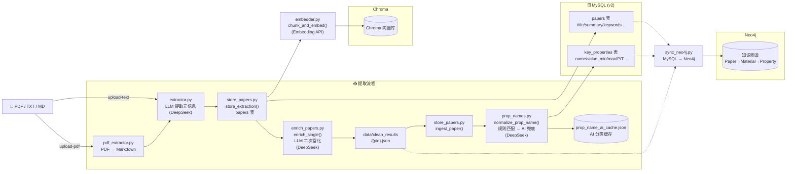

# ingest 管线全景

## 模块职责

| 模块 | 职能 | 写入目标 |
|------|------|----------|
| `pdf_extractor.py` | PDF → Markdown | — |
| `extractor.py` | Markdown → ExtractionResult (LLM) | — |
| `store_papers.py` | `store_extraction()` → papers · `ingest_paper()` → key_properties | MySQL |
| `enrich_papers.py` | `enrich_single()` 单篇 LLM 富化 → clean_results JSON | 文件系统 |
| `prop_names.py` | `normalize_prop_name()` 规则匹配 + `ai_normalize()` AI 兜底 | — |
| `embedder.py` | `chunk_and_embed()` 全文 → Chroma | Chroma |
| `chunker.py` | Markdown → `List[Chunk]` | 被 embedder 调用 |
| `pipeline.py` | 编排入口 `ingest_pdf()` | — |
| `sync_neo4j.py` | MySQL + clean_results → Neo4j | Neo4j |
