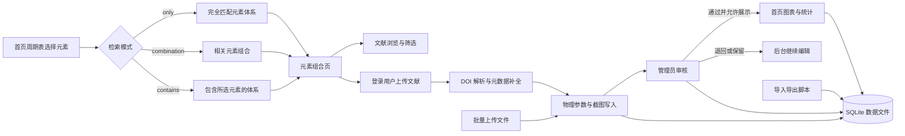
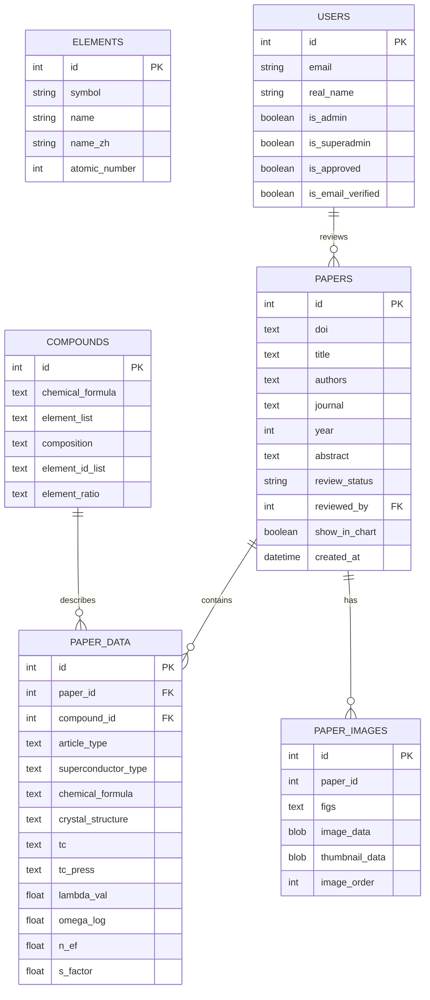

# Conventional-SC-Dataset 文章规划与初稿

## 1. 写作规划

### 1.1 文章定位

本文更适合写成一篇“超导文献与物性数据资源平台”或“科研数据库系统构建”文章，而不是算法性能论文。当前仓库约 15,044 行前后端与运维代码，包含 10 个后端 API 模块、67 个后端路由、9 个主要页面模板、元素检索、文献上传、审核管理、图表展示、批量导入导出、Tc 预测实验入口和备份脚本。这些证据足以支撑一篇以系统设计、数据组织和科研工作流闭环为核心的文章。

推荐题目：

**Conventional-SC-Dataset: 面向超导文献、元素体系与物性参数的可审核数据平台**

备选题目：

- **A curated web platform for element-centric superconductivity literature and physical-parameter data**
- **元素组合驱动的超导文献数据库与物性数据管理平台**
- **面向超导研究的数据采集、审核与可视化平台构建**

### 1.2 文章类型

推荐文章类型：资源型论文、数据库论文、科研软件论文或系统论文。

不推荐定位为：材料发现论文、机器学习预测论文或高通量计算论文。原因是当前代码已经包含 Tc 预测实验模块，但缺少模型性能、基准比较、外部验证集、消融实验和误差分析，尚不足以支撑算法主张。

### 1.3 一句话核心论点

在超导文献和物性参数分散于不同论文、体系和录入习惯的问题中，Conventional-SC-Dataset 通过元素组合检索、DOI 驱动录入、多组物理参数承载、管理员审核和图表展示控制，建立了一个面向“采集-整理-审核-展示”的轻量化数据库平台；当前证据主要来自代码实现、数据库结构、API 闭环和本地数据文件，边界是尚未形成正式社区互动与模型性能验证。

### 1.4 证据边界

已可支持的主张：

- 系统围绕元素、化合物、文献、物理参数、截图和用户权限建立了明确数据模型。
- 前端支持周期表入口、组合页浏览、上传弹窗、后台审核和实验预测页面。
- 后端支持元素组合检索、文献创建与批量上传、认证、管理员审核、图表数据和实验预测接口。
- 当前 AI 筛选数据库文件中可检出 688 条文献、1,010 个化合物、2,624 条物性数据记录；其中 1,921 条记录包含 Tc 字段，2,068 条记录包含压力字段。
- 系统已有部署、初始化、导入导出和备份脚本，具备工程化维护基础。

需要避免或标注为边界的主张：

- 不声称系统已经完成大规模公开上线验证。
- 不声称 Tc 预测模块已被系统性验证。
- 不声称具备点赞、评论、弹幕、热度排序等社区功能。
- 不声称默认主数据库已经装载完整文献；当前默认主数据库 `hydride_literature.db` 主要包含元素基础表，AI 筛选数据库 `hydride_literature_ai.db` 中包含更多文献数据。

### 1.5 文章结构

1. 摘要：提出分散文献与物性参数整理瓶颈，介绍平台和主要能力。
2. 引言：说明超导研究中元素体系、文献证据和物理参数之间的组织困难。
3. 系统设计：描述元素组合、文献、物理参数、图片和权限审核的数据模型。
4. 工作流实现：描述检索、上传、审核、导入导出、图表与预测实验入口。
5. 当前数据与功能验证：用代码规模、API 模块、本地数据统计和页面入口说明实现程度。
6. 讨论：说明平台价值、边界和下一阶段演进。
7. 结论：收束为可复用、可审核、可扩展的超导数据管理基础设施。

## 2. 正文初稿

### 标题

**Conventional-SC-Dataset: 面向超导文献、元素体系与物性参数的可审核数据平台**

### 摘要

超导研究依赖大量分散在论文、补充材料和结构化表格中的材料体系、临界温度、压力条件和电子-声子相关参数。尽管公共文献数据库能够提供论文级检索，研究者在比较不同元素组合、追踪物理参数来源、管理截图证据和控制数据审核状态时，仍需要大量手工整理。本文介绍 Conventional-SC-Dataset，一个以元素组合为入口的超导文献与物性参数管理平台。该系统将化学元素、化合物、文献元数据、多组物理参数、文献截图、用户权限和审核状态组织为统一的数据模型，并提供周期表检索、组合页浏览、DOI 驱动上传、批量导入、管理员审核、图表展示控制和实验性 Tc 预测入口。当前代码库约 15,044 行，包含 10 个后端 API 模块、67 个路由和 9 个主要页面模板；本地 AI 筛选数据库包含 688 条文献、1,010 个化合物和 2,624 条物性数据记录。该平台的主要贡献不是提出新的超导机制或预测模型，而是提供一个可审核、可维护、可扩展的工程基础，用于把分散的超导文献证据转化为面向元素体系的结构化数据资源。

### 引言

超导材料研究通常围绕元素组成、晶体结构、压力条件和临界温度等信息展开。对于氢化物、铜氧化物、铁基、镍基、有机和碳基等不同体系，关键证据往往分布在大量论文中，并以正文描述、表格、图像或补充材料的形式出现。研究者如果希望回答“某一组元素组合下有哪些相关文献”“某篇文献报告了哪些压力和 Tc 数据点”“哪些数据已经经过人工审核并适合进入统计图表”等问题，通常需要在文献管理软件、电子表格和手工笔记之间反复切换。

现有文献数据库擅长提供论文层面的元数据检索，但它们并不总是以超导研究所需的元素组合和物理参数为核心组织信息。另一方面，面向材料数据的专用数据库往往更强调结构、能量或计算任务，而不一定覆盖文献上传、截图证据、人工审核、贡献者管理和面向网页用户的交互式检索流程。因此，一个面向超导文献整理的实用平台，需要同时处理科研数据结构化和协作管理两个问题：既要让数据能够围绕元素体系被检索和复用，也要让数据进入数据库之前经过可追踪的录入与审核过程。

Conventional-SC-Dataset 针对这一需求构建了一个轻量化网站系统。系统以周期表为主要入口，将用户选择的元素标准化为组合检索条件，并支持 `only`、`combination` 和 `contains` 三种检索模式。文献数据通过 DOI、化学式、晶体结构、文章类型、超导体类型、物理参数和截图共同描述；管理员可以审核、编辑、批量操作文献，并控制其是否进入首页统计图表。这样的设计把“找体系、看文献、录数据、审数据、展示数据”组织为一个连续工作流，而不是分散的脚本或静态表格。

本文报告该平台的当前实现状态、数据模型和主要工作流。我们的目标是明确说明系统已经能够支撑哪些科研数据管理任务，以及哪些能力仍属于实验或规划阶段。本文不声称该平台已经解决超导材料发现问题，也不将实验性 Tc 预测模块作为经过充分验证的模型贡献；相反，本文强调一个可审计数据平台对后续数据积累、人工校验、统计展示和模型训练前处理的基础作用。

### 系统设计

Conventional-SC-Dataset 的核心对象包括元素、化合物、文献、物理参数、图片和用户。元素表保存 118 个化学元素的基础信息，用于周期表渲染和元素合法性校验。化合物表保存化学式、元素列表、组成信息和元素比例，并为组合检索提供标准化表示。文献表保存 DOI、标题、作者、期刊、年份、摘要、贡献者信息、审核状态和图表展示开关。物理参数表与文献和化合物关联，记录文章类型、超导体类型、化学式、晶体结构、Tc、压力、电子-声子耦合参数、对数平均声子频率、费米能级态密度和样品信息。图片表用于保存文献截图及缩略图。

这种数据模型的设计重点是把论文级信息和数据点级信息分离。一篇文献可以包含多组物理参数，每组参数可以对应不同样品、结构、压力区间或数据来源说明。该设计避免把一篇论文简化为一个单值记录，也为后续按照化学式、结构类型、压力和 Tc 进行更细粒度筛选留下了清晰的数据承载位置。

用户和权限模型承担协作质量控制任务。普通用户可以注册、完成邮箱验证并提交文献；管理员可以审核、编辑和管理文献；超级管理员可以审批管理员申请并管理用户权限。审核状态、审核意见、审核人和审核时间被纳入文献记录，使平台不仅能保存数据，也能记录数据从提交到进入可展示状态的过程。

### 工作流实现

平台的主要使用路径从首页周期表开始。用户选择元素后，前端将元素集合提交到组合检索接口，后端对元素进行去重、排序和模式校验。`only` 模式用于查找元素集合完全匹配的体系，`combination` 模式用于查找所选元素的相关组合，`contains` 模式用于查找包含所选元素的更大体系。检索结果随后进入元素组合页，用户可以按关键词、年份、审核状态等条件浏览文献。

文献录入流程围绕 DOI 和结构化物性数据展开。登录用户可以在组合页提交 DOI、文章类型、超导体类型、化学式、晶体结构、贡献者信息、备注、多组物理参数和最多 5 张截图。后端负责 DOI 格式校验、元数据解析、元素组合创建、文献记录创建、物理参数写入和图片处理。批量上传接口则支持通过约定格式文件一次性导入历史数据，适合从已有表格或 JSON 文件迁移到数据库。

审核流程把数据质量控制嵌入后台管理页面。管理员可以查看未审核文献、更新审核状态、编辑文献信息、查看截图并控制文献是否进入首页图表。超级管理员可以执行管理员审批、用户权限变更和更高风险的批量管理操作。这样的权限分层使平台能够在开放投稿和集中审核之间保持平衡。

可视化与实验模块为数据使用提供入口。首页图表从数据库读取已授权展示的数据，用于呈现 Tc、压力和文献统计趋势。贡献者排行接口用于展示数据贡献情况。`/tc-pre` 页面提供结构文件和 PDOS 文件上传入口，用于运行实验性的 Tc 估算流程。该预测模块当前不写入主数据库，也不参与审核闭环，因此在本文中被视为实验功能，而不是平台的核心验证结果。

### 当前实现与数据状态

从工程规模看，当前代码库已经超过原型阶段。仓库包含约 15,044 行 Python、JavaScript、HTML、CSS 和 Shell 代码。其中后端包括元素、化合物、文献、认证、管理员、AI 筛选文献、Alexandria 数据、HTSC-2025 数据和 Tc 预测等 API 模块；前端包括首页、组合页、登录注册、管理员审核、超级管理员面板、全局文献管理和预测实验页面；运维脚本覆盖初始化、导入导出、迁移、超级管理员创建和远程备份。

从本地数据文件看，默认主数据库 `hydride_literature.db` 当前主要保留元素基础数据，包含 118 个元素、1 个化合物记录，尚未装载主文献数据。另一个 AI 筛选数据库 `hydride_literature_ai.db` 已包含 688 条文献、1,010 个化合物和 2,624 条物性数据记录，其中 1,921 条记录包含 Tc 字段，2,068 条记录包含压力字段。这个状态说明平台的数据承载能力已经在独立数据文件中得到使用，但主库与 AI 筛选库之间仍需要更清晰的数据同步、导入策略或论文写作中的范围说明。

从功能覆盖看，系统已经实现了“采集、整理、审核、展示”的主要闭环。已经落地的能力包括周期表检索、元素组合页浏览、关键词和年份筛选、登录后上传、批量导入、管理员审核、图表展示开关、JSON 导入导出和前端引用导出。尚未完整落地的能力包括基于压力和 Tc 的正式一等筛选、图表点击到检索结果的联动、系统化统计分析、点赞、评论、弹幕、热度排序和数据库快照管理。

### 讨论

Conventional-SC-Dataset 的主要价值在于把超导文献整理从静态表格推进为可审核的交互式数据平台。元素组合检索使用户能够从材料组成出发进入文献集合；多组物理参数模型使一篇论文内部的多个样品或条件能够被独立记录；审核和图表展示开关使数据发布具有人工质量控制；导入导出和备份脚本则降低了长期维护成本。

该平台也暴露出几个需要在后续版本中优先解决的问题。第一，文献与提交用户之间目前主要通过贡献者姓名关联，而不是稳定的用户外键，这会影响贡献统计和责任追踪。第二，图片以 BLOB 形式存入 SQLite，对当前规模而言简单直接，但随着截图数量增长可能导致数据库膨胀。第三，当前缺少正式 schema migration 体系，长期迭代数据库字段和索引时会增加维护风险。第四，压力和 Tc 字段已经存在于物理参数表中，但还没有在检索 API 中成为完整的一等筛选条件。

这些限制并不削弱平台作为数据整理基础设施的定位，但它们定义了平台当前的边界。下一阶段更合理的演进顺序不是一次性引入所有社区功能，而是优先补齐 `contributor_user_id`、压力/Tc 筛选、索引策略、后端引用导出和数据库迁移体系。只有当文献、用户、物理参数和审核流程更加稳定之后，点赞、评论、弹幕和热度排序等互动功能才更适合进入数据模型。

### 结论

本文介绍了 Conventional-SC-Dataset，一个面向超导文献、元素体系和物性参数的可审核数据平台。该系统以元素组合检索为入口，将文献元数据、多组物理参数、截图证据、用户权限和审核状态组织为统一工作流，支撑从数据提交到审核展示的闭环。当前代码和本地数据文件表明，该平台已经具备资源型数据库论文所需的主要工程基础，但尚不适合被描述为经过充分验证的预测模型或社区互动平台。后续工作应优先加强用户-文献关系建模、物理参数筛选、数据库迁移和数据同步机制，从而为更大规模的超导数据积累、统计分析和模型训练提供更稳固的数据基础。

## 3. 主张-证据映射

| 主张 | 证据 | 状态 |
|---|---|---|
| 平台已形成以元素组合为入口的超导文献检索系统 | `frontend/static/js/periodic_table.js`、`backend/api/compounds.py`、`backend/api/papers.py`、`docs/business-search-and-discovery.md` | 已支持 |
| 平台支持文献上传、物理参数录入和截图证据 | `backend/api/papers.py`、`backend/models.py`、`frontend/static/js/compound_page.js` | 已支持 |
| 平台支持用户、管理员、超级管理员分层审核 | `backend/api/auth_routes.py`、`backend/api/admin.py`、`docs/business-auth-and-review.md` | 已支持 |
| 平台具备数据库论文级工程规模 | 约 15,044 行代码、10 个 API 模块、67 个路由、9 个页面模板 | 已支持 |
| 平台已有可用数据承载实例 | `hydride_literature_ai.db` 中 688 条文献、1,010 个化合物、2,624 条物性数据记录 | 已支持，但需说明数据文件范围 |
| Tc 预测模块是核心科学贡献 | 当前缺少模型验证、基准比较和误差分析 | 证据不足 |
| 社区互动功能已经落地 | 当前无点赞、评论、弹幕和热度相关表结构 | 不支持 |

## 4. 图表材料

### 4.1 平台工作流图



### 4.2 数据模型图



### 4.3 代码模块统计表

| 范围 | 统计值 | 说明 |
|---|---:|---|
| 总代码量 | 15,044 行 | 统计 Python、JavaScript、HTML、CSS、Shell 文件 |
| 后端代码 | 7,276 行 | `backend/**/*.py` |
| 前端代码 | 7,481 行 | `frontend/**/*.js`、`frontend/**/*.html`、`frontend/**/*.css` |
| 运维脚本 | 287 行 | `scripts/**/*.sh` |
| 后端 API 模块 | 10 个 | `backend/api/*.py`，不含 `__init__.py` |
| 后端路由 | 67 个 | 统计 FastAPI `get/post/put/delete/patch` 装饰器 |
| 主要页面模板 | 9 个 | `frontend/templates/*.html` |

### 4.4 数据库统计表

| 数据文件 | 指标 | 当前值 | 说明 |
|---|---:|---:|---|
| `hydride_literature.db` | 元素数 | 118 | 默认主数据库当前主要承载基础元素表 |
| `hydride_literature.db` | 化合物数 | 1 | 当前未装载完整主文献数据 |
| `hydride_literature_ai.db` | 文献记录数 | 688 | AI 筛选数据库中的 `papers` 表 |
| `hydride_literature_ai.db` | 去重 DOI 数 | 429 | `papers.doi` 去重统计 |
| `hydride_literature_ai.db` | 化合物数 | 1,010 | `compounds` 表 |
| `hydride_literature_ai.db` | 物性数据记录数 | 2,624 | `paper_data` 表 |
| `hydride_literature_ai.db` | 含 Tc 字段记录数 | 1,921 | `paper_data.tc` 非空记录 |
| `hydride_literature_ai.db` | 含压力字段记录数 | 2,068 | `paper_data.tc_press` 非空记录 |
| `hydride_literature_ai.db` | 年份范围 | 1909-2025 | `papers.year` 最小值到最大值 |
| `hydride_literature_ai.db` | 期刊数 | 105 | `papers.journal` 去重统计 |

### 4.5 功能边界表

| 功能 | 当前状态 | 证据来源 | 论文写作口径 |
|---|---|---|---|
| 周期表元素检索 | 已实现 | `periodic_table.js`、`compounds.py` | 可作为核心入口能力 |
| 三种组合检索模式 | 已实现 | `CompoundSearchRequest.mode` | 可明确写入方法部分 |
| 组合页文献浏览 | 已实现 | `compound_page.js`、`papers.py` | 可作为主要用户工作流 |
| DOI 驱动上传 | 已实现 | `papers.py`、`doi_resolver.py` | 可写为数据采集能力 |
| 多组物理参数记录 | 已实现 | `PaperData` 模型 | 可写为数据点级承载能力 |
| 截图证据保存 | 已实现 | `PaperImage` 模型、图片接口 | 可写为证据管理能力，但需说明 SQLite BLOB 边界 |
| 管理员审核 | 已实现 | `admin.py`、后台页面 | 可写为质量控制机制 |
| 图表展示控制 | 已实现 | `show_in_chart` 字段、图表接口 | 可写为审核后展示机制 |
| 批量导入导出 | 已实现 | `import_data.py`、`export_data.py`、批量上传接口 | 可写为数据迁移能力 |
| Tc 预测实验页 | 实验功能 | `tc_predict.py`、`tc_pre.js` | 只能写为实验入口，不能写为已验证模型贡献 |
| 压力/Tc 一等筛选 | 部分落地 | 字段存在，正式筛选不足 | 写作中标注为后续增强 |
| 点赞、评论、弹幕 | 未实现 | 当前无对应表结构 | 不写成现状，只能放入未来工作 |

### 4.6 可复现实验说明

当前草案可在正式投稿前补充以下最小复现实验步骤，用于证明平台可运行性：

```bash
python -m backend.init_db
python -m backend.create_superadmin
uvicorn backend.main:app --host 0.0.0.0 --port 8000
```

启动后可访问以下入口进行人工验证：

| 入口 | 验证内容 |
|---|---|
| `/` | 首页周期表、图表与快速上传入口 |
| `/compound/{element_symbols}` | 元素组合页、文献筛选、上传弹窗 |
| `/login` | 普通用户和管理员登录 |
| `/admin/dashboard` | 管理员文献审核 |
| `/admin/superadmin` | 超级管理员审批与用户权限管理 |
| `/admin/papers` | 全局文献管理 |
| `/tc-pre` | 实验性 Tc 预测入口 |
