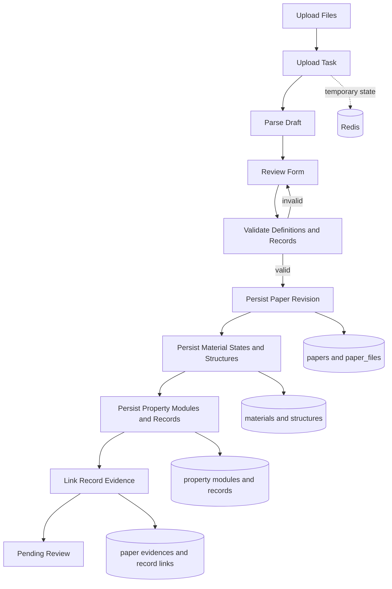

# 上传数据结构与表单映射

## 功能说明

上传功能处理一份以论文 revision 为根、以材料状态为核心的层级草稿。用户上传论文和结构附件后，
系统在 Redis 中保存解析任务与可校对草稿；正式提交前，前后端依据同一版本化
`FormDefinition` 校验模块化物性记录，提交事务只写 MySQL 目标契约。

本文只描述“超导数据去中心化上传”当前实际使用的数据结构。账号、审核事件、检索索引、外部数据集
和图表组合不属于本表单的直接写入范围。

## 数据存放分层

| 存放位置 | 数据 | 生命周期 | 作用 |
| --- | --- | --- | --- |
| Redis | `upload_task` 状态、上传文件清单、AI 解析草稿、用户校对结果、清理时间 | 创建任务后到任务清理或提交完成 | 支撑异步解析和可恢复校对，不是正式科研数据 |
| 文件存储 | 原始 PDF/TXT/MD、补充材料、CIF/POSCAR 附件 | 上传后保留；正式提交时作为论文文件保存 | 保存原始来源和结构附件 |
| MySQL | 论文 revision、材料状态、结构、模块化物性记录、定义和 Evidence | 用户提交后成为待审核正式记录 | 审核、检索和论文详情的关系型事实来源 |

“草稿”指 Redis 的 `draft` JSON；提交成功前不会形成论文业务记录。“论文 revision”指
`papers.content_revision`。科学实体都携带或可追溯到 `paper_id + paper_revision`，不会把不同版本的
材料、结构、记录或 Evidence 混在一起。

## 表单与持久化映射

一个论文草稿可包含多个材料状态。同一化学式在不同压力、温度、磁场、理论/实验条件或空间群下，
应作为不同材料状态录入。

| 表单分组 | 关键字段 | 是否可重复 | 落库去向 |
| --- | --- | --- | --- |
| 论文基本信息 | DOI、标题、期刊、卷页、年份、摘要、作者 | 否 | `papers` |
| 论文分类与 AI 摘要 | 论文类型、超导体类别、材料家族、摘要、关键词、方法、主要发现、研究动机 | 材料家族可多选 | `papers`、`material_families`、`paper_material_families` |
| 上传文件 | 文件角色、原文件名、存储路径、SHA-256、大小、媒体类型、排序 | 是 | `paper_files` |
| 材料状态 | 化学式、元素数、材料维度、晶系、压力、温度、磁场、状态类型、报告空间群、备注 | 是，核心重复单元 | `chemical_systems`、`superconductors`、`material_states` |
| 结构家族 | 结构家族名称、是否主家族 | 每个状态可多选，最多一个主项 | `structure_families`、`material_state_structure_families` |
| 结构模型 | CIF/POSCAR 文本、格式、空间群、晶胞、原子数、计算方法、来源位置 | 每个状态可有多个 | `structure_models` |
| 物性模块 | 超导、动力学、热力学、电子性质 | 按需添加、排序和删除 | `property_modules` |
| 物性记录 | 类型、物性代码、原始值、规范值、单位、方法、代表标记、定义版本 | 每个模块可有多条 | `property_records` |
| Conditions 与参数 | 计算或实验 Conditions、lambda、omega log、mu*、网格、展宽及预留扩展字段 | 每条记录独立拥有 | `property_records.payload_json` |
| 论文证据 | 字段路径、章节、页码范围、原文引句 | 是 | `paper_chunks`、`paper_evidences`、`property_record_evidences` |

首批物性模块为 `superconductive_properties`、`dynamical_properties`、
`thermodynamic_properties` 和 `electronic_properties`。模块只在用户实际添加时提交；记录通过
`record_key` 在模块内保持稳定身份。预测 Tc 必须使用 `calculation_conditions`，测量 Tc 必须使用
`experimental_conditions`，两类 Conditions 互斥且都属于当前记录。

数值、范围、文本和布尔值通过固定核心列表达；`payload_json` 只保存定义声明的 Conditions、参数和
预留扩展字段。`0` 与 `false` 是有效值，不能按空值丢弃。每条记录绑定不可变的
`definition_key + definition_version`，后端依据该版本执行 JSON Schema、JSON Pointer 和业务规则校验。

## MySQL 关系

### 论文、材料与结构

| 表 | 主键与主要关联 | 保存内容 |
| --- | --- | --- |
| `papers` | `id`；`content_revision` 是当前内容版本 | 书目信息、审核状态、上传者和 LLM 富化字段 |
| `paper_files` | `paper_id + paper_revision` | 正文、补充材料和附件元数据 |
| `paper_chunks` | 关联文件与论文 revision | 从正文切分出的可引用文本块 |
| `paper_evidences` | 关联 Chunk 与论文 revision | 字段路径、章节、页码和原文引句 |
| `chemical_systems` | 属于 `paper_id + paper_revision` | 元素体系键和元素列表 |
| `superconductors` | 属于 `paper_id + paper_revision`，关联化学体系 | 化学式、规范化化学式、组成和显示名 |
| `material_states` | 属于论文 revision，关联一个超导体 | 压力、温度、磁场、状态类型、晶系、报告空间群和备注 |
| `structure_models` | 关联材料状态与论文 revision | 结构文本、格式、哈希、空间群、晶胞和计算来源 |

`chemical_systems` 和 `superconductors` 都由论文 revision 拥有。同名 LaH10 出现在两篇论文时使用
不同主键，跨论文查询通过规范化学式、组成和体系键聚合，不通过共享材料实体关联。

### 模块化物性与定义

| 表 | 主键与主要关联 | 保存内容 |
| --- | --- | --- |
| `property_modules` | 关联一个 `material_state`；模块代码在该状态内唯一 | 按需挂载的模块及排序 |
| `property_records` | 关联模块、材料状态、论文 revision 和定义版本 | 固定检索列、值、单位、方法、代表标记和 `payload_json` |
| `property_record_evidences` | `property_record_id` ↔ `paper_evidence_id`，要求同 revision | 记录级或字段路径级来源 |
| `form_definitions` | `definition_key + version` 唯一 | JSON Schema、UI 提示、规则、状态和校验和 |
| `form_definition_audit_events` | 关联定义及操作者 | 发布、停用、升级、回滚和管理员提升审计 |

发布后的定义不可原地修改；停用版本仍可解释历史记录，但不能用于新建记录。记录升级与回滚均显式
执行并写审计事件，不会在读取时自动改写。管理员可将已批准的论文内自定义性质提升为全站定义；
提升不改变源记录、Evidence 或历史定义绑定。

## 提交流程

正式提交先校验完整草稿和所有定义，再在事务中写入论文 revision、材料状态、结构、模块、记录和
Evidence 关联。任一校验失败都不会留下部分正式科研数据。旧缓存草稿只在输入边界单向转换为
Schema v2；v2 载荷和规范 property identity 不会再次被旧转换覆盖，正式持久化不再双写旧科学表。

## 关键约束

- 一个材料状态必须关联同一论文 revision 的超导体；结构、记录和 Evidence 不得跨 revision。
- 压力范围必须两端同时存在或同时缺失，且最小值不大于最大值；压力、温度和磁场数值不得为负。
- 报告空间群编号为空或位于 1 到 230；它不等同于结构文本解析出的确认空间群。
- 一个材料状态可关联多个结构家族，但最多一个主结构家族。
- 非空物性模块不能隐式级联删除；先显式处理记录，再删除模块。
- 每个“论文 revision + MaterialState + Tc 记录类型 + 方法”最多一条代表 Tc。
- 新批准或重新批准的记录至少关联一条当前 revision 的 Evidence；历史迁移不伪造缺失证据。
- 自定义字段只能出现在定义预留分组中，不能覆盖固定核心字段或系统键。

## 代码依据

- `backend/models.py`：Python SQLAlchemy 目标模型及数据库约束。
- `goserver/models/models.go`：Go 目标表映射。
- `backend/ingest/upload_contracts.py`：Schema v2 上传契约和旧草稿边界转换。
- `backend/ingest/property_modules.py`：模块化记录规范化与校验。
- `backend/ingest/scientific_drafts.py`：正式提交事务。
- `backend/services/form_definition_service.py`：定义生命周期和校验。
- `frontend/src/components/PropertyModuleEditor.tsx`：模块与记录编辑器。
- `frontend/src/components/SchemaDrivenRecordForm.tsx`：定义驱动表单。

## 当前边界

- 上传任务状态仍由 Redis 管理，正式提交后通过 `papers.upload_task_id` 回溯来源任务。
- 结构附件只有经用户确认后才持久化为 `structure_models`；浏览器中的结构候选不等于正式记录。
- 本文描述应用当前目标契约和隔离 MySQL 已验证行为，不表示任一生产数据库已经执行迁移。
- 审核后的向量发布、检索索引和 Neo4j/Qdrant 生命周期不属于上传表单直接写入范围。

## 相关变更记录

- [Feature #90：MaterialState 模块化物性与动态表单](../../specs/90-unified-superconductor-properties/spec.md)
