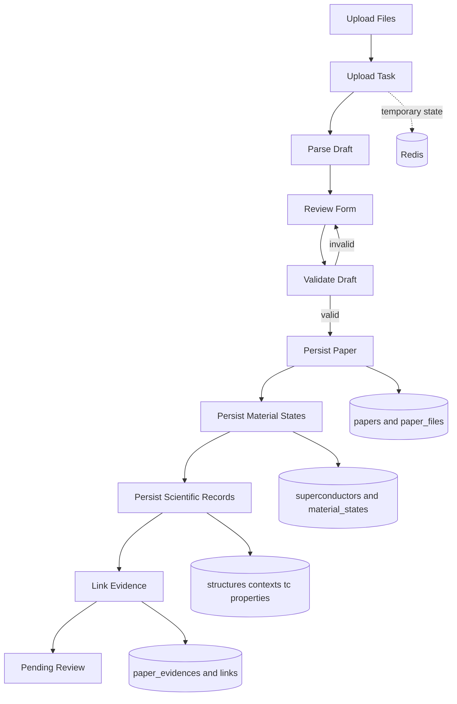

# 上传数据结构与表单映射

## 功能说明

上传功能处理的不是一张扁平表单，而是一份以论文为根、以材料状态为核心的层级草稿。用户先上传论文和结构附件，系统在 Redis 中保存解析任务和可校对草稿；用户确认后，服务把草稿拆分写入 MySQL 的论文、材料、条件、Tc、物性、结构和证据关联表。

本文只描述“超导数据去中心化上传”当前实际使用的数据结构。账号、审核事件、检索索引、外部数据集和图表组合等表不属于本表单的直接写入范围。

## 模块化物性记录（Issue #90）

材料状态现可携带 `property_modules[]`。首批模块为超导、动力学、热力学和电子性质；模块只在用户
实际添加时提交，记录通过 `record_key` 平级保存。每条记录包含值类型、单位、方法、代表标记以及
`payload` 内的 Conditions、参数和预留扩展字段。预测 Tc 只能使用计算 Conditions，测量 Tc 只能使用
实验 Conditions，服务端按绑定的版本化 `FormDefinition` 统一校验。

旧草稿仍在上传边界单向转换为模块化记录；目标表由 `issue90_expand_modular_property_schema` 建立，
历史数据复制由 `backend/scripts/migrate_issue90_properties.py` 幂等执行。切换前必须完成逐项对账，
不会因为迁移缺失 Evidence 而伪造来源。

## 数据存放分层

| 存放位置 | 数据                                                                  | 生命周期                               | 作用                                             |
| -------- | --------------------------------------------------------------------- | -------------------------------------- | ------------------------------------------------ |
| Redis    | `upload_task` 状态、上传文件清单、AI 解析草稿、用户校对结果、清理时间 | 创建任务后到任务清理或提交完成         | 支撑异步解析和可恢复的校对界面，不是正式科研数据 |
| 文件存储 | 原始 PDF/TXT/MD、补充材料、CIF/POSCAR 附件                            | 上传后保留；正式提交时作为论文文件保存 | 保存原始来源和结构附件                           |
| MySQL    | 论文及其版本、材料状态、Tc、物性、结构、证据                          | 用户提交后成为待审核正式记录           | 提供审核、检索和论文详情读取的事实来源           |

这里的“草稿”指 Redis 中 `draft` 字段保存的 JSON 结构；它可以被用户反复编辑，但在提交成功前不会形成论文业务记录。这里的“论文版本”指 `papers.content_revision`：所有科学明细表同时保存 `paper_id` 和 `paper_revision`，因此明细属于某个确定的论文版本，而不是只属于论文编号。

## 表单结构

用户在校对界面看到的主要录入单元如下。一个论文草稿可包含多个“材料状态”；同一化学式在不同压力、温度、磁场、理论/实验条件或空间群下，应作为不同材料状态录入。

| 表单分组           | 关键字段                                                                          | 是否可重复                         | 落库去向                                                  |
| ------------------ | --------------------------------------------------------------------------------- | ---------------------------------- | --------------------------------------------------------- |
| 论文基本信息       | DOI、标题、期刊、卷页、年份、摘要、作者                                           | 否                                 | `papers`                                                  |
| 论文分类与 AI 摘要 | 论文类型、超导体类别、材料家族、摘要、关键词、方法、主要发现、研究动机等          | 材料家族可多选                     | `papers`、`material_families`、`paper_material_families`  |
| 上传文件           | 文件角色、原文件名、存储路径、SHA-256、大小、媒体类型、排序                       | 是                                 | `paper_files`                                             |
| 材料状态           | 化学式、元素数、材料维度、晶系、压力、温度、磁场、状态类型、报告空间群、备注      | 是，核心重复单元                   | `chemical_systems`、`superconductors`、`material_states`  |
| 结构家族           | 结构家族名称、是否主家族                                                          | 每个材料状态可多选，但最多一个主项 | `structure_families`、`material_state_structure_families` |
| 结构模型           | CIF/POSCAR 文本、格式、空间群、晶胞、原子数、计算方法、来源位置                   | 每个材料状态可有多个               | `structure_models`                                        |
| 理论计算上下文     | 电子/声子/EPC 方法、赝势、SOC、lambda、omega log、mu*、k/q 网格、截断能、计算软件 | 可选                               | `calculation_contexts`                                    |
| 实验测量上下文     | 样品标识、制备方式、测量方法、Tc 判据、外加磁场、压力不确定度                     | 可选                               | `experimental_contexts`                                   |
| Tc 结果            | 理论或实验类型、方法、Tc 单值或区间、不确定度、原文值与单位、来源位置             | 是                                 | `tc_results`                                              |
| 非 Tc 物性         | 属性名、原文数值和单位、数值/区间、规范单位、条件说明                             | 是                                 | `property_definitions`、`superconductor_properties`       |
| 论文证据           | 字段路径、章节、页码范围、原文引句                                                | 是                                 | `paper_chunks`、`paper_evidences` 及三张证据关联表        |

`Tc` 是专用科研结果，必须写入 `tc_results`，不能作为普通物性写进 `superconductor_properties`。类似地，lambda、omega log 和 mu* 属于理论计算上下文，不应附着到实验 Tc 记录上。

## MySQL 关系表

### 论文根与来源

| 表                | 主键与主要关联                                 | 保存内容                                                       |
| ----------------- | ---------------------------------------------- | -------------------------------------------------------------- |
| `papers`          | `id`；`content_revision` 与明细表组成版本关联  | 论文书目信息、审核状态、上传者、关联上传任务、LLM 富化字段     |
| `paper_files`     | `id`；`paper_id + paper_revision` 指向论文版本 | 正文、补充材料和附件的角色、文件名、路径、哈希、大小和媒体类型 |
| `paper_chunks`    | `id`；关联 `paper_files` 与论文版本            | 从正文切分出的章节、标题、文本、页码和 token 数                |
| `paper_evidences` | `id`；关联 `paper_chunks` 与论文版本           | 表单字段路径、章节、页码和可复核原文引句                       |

### 材料状态主链

| 表                                  | 主键与主要关联                                                  | 保存内容                                                                         |
| ----------------------------------- | --------------------------------------------------------------- | -------------------------------------------------------------------------------- |
| `chemical_systems`                  | `id`；被 `superconductors.chemical_system_id` 引用              | 元素体系键、元素列表和元素数量                                                   |
| `superconductors`                   | `id`；关联化学体系；被 `material_states.superconductor_id` 引用 | 化学式、规范化化学式、组分键、同位素标记、显示名和元素组分                       |
| `material_states`                   | `id`；`paper_id + paper_revision` 指向论文版本；关联一个超导体  | 在确定实验或理论条件下的材料：压力、温度、磁场、状态类型、晶系、报告空间群和备注 |
| `structure_families`                | `id`                                                            | 结构家族规范目录                                                                 |
| `material_state_structure_families` | `material_state_id + structure_family_id`                       | 材料状态与结构家族的多对多关系；`is_primary` 标识主结构家族                      |

`material_states` 是数据模型的中心。举例说，LaH10 在 170 GPa 的实验 Tc 与 200 GPa 的理论 Tc 应对应两条材料状态；两条记录可以共同引用同一个 `superconductors` 化学式实体，但各自拥有独立的条件、Tc 和结构数据。

### 条件化科研结果

| 表                          | 主键与主要关联                                                 | 保存内容                                                                    |
| --------------------------- | -------------------------------------------------------------- | --------------------------------------------------------------------------- |
| `structure_models`          | `id`；关联材料状态和论文版本；可关联父结构                     | CIF/POSCAR 等结构文本、格式、哈希、空间群、晶胞参数、体积、原子数和计算来源 |
| `calculation_contexts`      | `id`；关联材料状态、论文版本；可关联结构模型                   | 理论计算条件和参数；有结构时引用 `structure_id`，无结构时必须说明缺失原因   |
| `experimental_contexts`     | `id`；关联材料状态、论文版本；可关联结构模型                   | 样品和测量条件，包括 Tc 判据、外场和压力不确定度                            |
| `tc_results`                | `id`；关联材料状态、论文版本；二选一关联理论或实验上下文       | Tc 方法、结果类型、单值/区间/不确定度、原文值、单位、来源定位和代表性标记   |
| `property_definitions`      | `id`                                                           | 非 Tc 物性的规范目录：代码、展示名、规范单位和值类型                        |
| `superconductor_properties` | `id`；关联材料状态、论文版本、物性定义；可关联结构或理论上下文 | 非 Tc 物性的原文值、数值化值、区间、单位和条件说明                          |

### 证据关联

| 表                                  | 关联                                                | 含义                         |
| ----------------------------------- | --------------------------------------------------- | ---------------------------- |
| `tc_result_evidences`               | `tc_result_id` ↔ `paper_evidence_id`               | Tc 结果对应的正文证据        |
| `structure_model_evidences`         | `structure_id` ↔ `paper_evidence_id`               | 结构模型对应的正文或附件证据 |
| `superconductor_property_evidences` | `superconductor_property_id` ↔ `paper_evidence_id` | 非 Tc 物性对应的正文证据     |

证据表不会替代业务数据。业务表保存“结论是什么”，`paper_evidences` 保存“结论来自论文哪一段”，三张关联表把两者连接起来。

## 提交流程

下图全部使用英文节点；其中文对应关系为：`Upload Files`=上传文件，`Upload Task`=上传任务，`Parse Draft`=解析草稿，`Review Form`=校对表单，`Validate Draft`=校验草稿，`Persist Paper`=写入论文，`Persist Material States`=写入材料状态，`Persist Scientific Records`=写入科研记录，`Link Evidence`=关联证据，`Pending Review`=待审核。

实际写入顺序与图一致：先创建 `papers` 记录，再逐个材料状态查找或创建 `chemical_systems` 与 `superconductors`，然后写入 `material_states`。在每个材料状态内，结构模型、理论/实验上下文、Tc 结果与普通物性按其所属关系写入；最后以字段路径建立正文证据及三类证据关联。任一校验失败都会回到校对表单，不应写出部分正式科研数据。

## 关键约束

- 一个 `material_states` 记录必须关联一个论文版本和一个超导体；同一论文可有多条材料状态。
- 压力区间要么两端都为空，要么两端都存在且最小值不大于最大值；压力、温度和磁场的数值不得为负。
- `reported_space_group_number` 为空或在 1 到 230 之间；它是论文报告值，不等同于从结构文本解析确认的 `structure_models.space_group_number`。
- 一个材料状态可关联多个结构家族，但最多一个 `is_primary=true`。
- `calculation_contexts` 必须在“关联结构”和“填写结构缺失原因”之间二选一。
- 理论 Tc 关联 `calculation_contexts`，实验 Tc 关联 `experimental_contexts`；两种上下文不能混用。
- 同一论文版本的文件、文本块和证据均携带 `paper_id + paper_revision`，防止审核或修订后把证据错误指向其他版本。

## 代码依据

- `goserver/models/models.go`：MySQL 表的 Go 映射及主要关联。
- `backend/models.py`：Python SQLAlchemy 模型和数据库约束。
- `backend/ingest/upload_jobs.py`：解析草稿的字段契约与规范化规则。
- `backend/ingest/scientific_drafts.py`：提交时从草稿写入关系表的实际顺序。
- `frontend/src/components/UploadTaskEditor.tsx`：校对表单的用户录入项。
- `alembic/versions/20260821_0008_add_superconducting_data_model.py`：条件化超导数据模型的迁移定义。

## 当前边界

- 上传任务本身没有 MySQL 业务表；运行状态、草稿和清理时间由 Redis 管理，正式提交后通过 `papers.upload_task_id` 回溯来源任务。
- 结构附件只有在用户明确确认后才会持久化为 `structure_models`；浏览器草稿中的结构候选及其转换表示不等同于正式结构记录。
- 本文描述提交后的待审核数据，不包含管理员审核后的向量发布、检索索引或 RAG 向量库写入。
