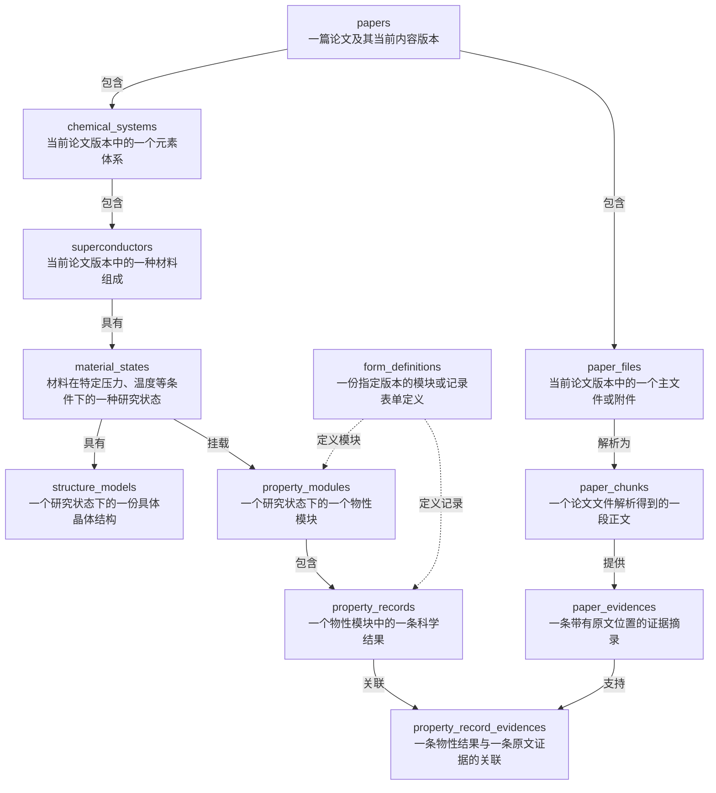
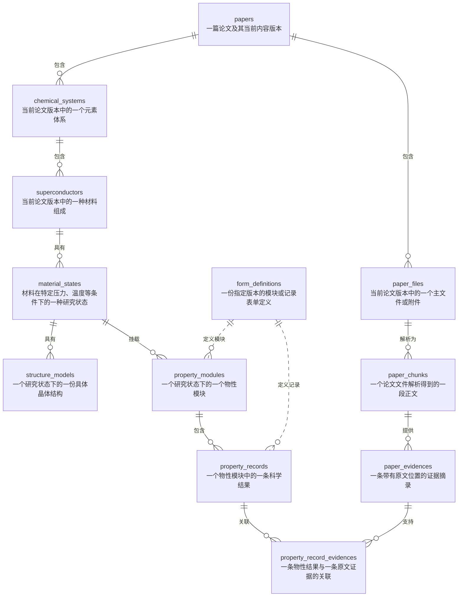

## 1.核心地图

### 流程图

用于表达数据关系



### 乌鸦脚记法

|| 表示恰好一个，o{ 表示零个或多个。




## 2. 七大主要表格：科研主体

本文行数来自 **2026-09-08 本地 MySQL 的只读查询快照**，会随数据更新变化。当前实例为 MySQL 8.4.2、`127.0.0.1:3307`，业务库为 `scwiki`，共 **39 张基础表**，迁移版本为 `issue90_data_integrity_repair_v1`。表格列出关键业务字段，不是逐列 DDL。

当前 8 份表单定义的内容与校验和全部一致；Hg 的 Tc 已关联同论文、同 revision 的 Evidence。当前 Python 后端完整导出函数已成功返回材料、状态、结构、物性、证据和定义。三张迁移临时表 `issue90_migration_checkpoint`、`issue90_migration_anomalies`、`issue90_property_migration_map` 已退役，早期的 42 张表清单不再适用。

“数据表”是 MySQL 中存数据的表；“表单定义”是 `form_definitions` 中的模板。一份模板可以被多条科学记录使用。

| 数据表             | 行数 | 一行表示什么                                     | 关键字段                                                                                                                               |
| ------------------ | ---: | ------------------------------------------------ | -------------------------------------------------------------------------------------------------------------------------------------- |
| `papers`           |    1 | 一篇论文及其当前内容版本                         | `doi`、`title`、`journal`、`year`、`authors`、`abstract`、`content_revision`、`approved_revision`、`review_status`                     |
| `chemical_systems` |    1 | 当前论文版本中的一个元素体系                     | `paper_id`、`paper_revision`、`system_key`、`elements_list`、`element_count`                                                           |
| `superconductors`  |    1 | 当前论文版本中的一种材料组成                     | `chemical_system_id`、`chemical_formula`、`formula_normalized`、`composition_key`、`isotope_signature`、`composition`、`element_ratio` |
| `material_states`  |    1 | 材料在特定压力、温度、结构分类等条件下的研究状态 | `superconductor_id`、`state_key`、压力、温度、磁场、`state_kind`、空间群、维度、晶系                                                   |
| `structure_models` |    1 | 一个状态下的一份具体晶体结构                     | `material_state_id`、`parent_structure_id`、`structure_format`、`structure_text`、`cell_parameters`、体积、原子数、计算方法            |
| `property_modules` |    1 | 某个状态下的一个物性模块                         | `material_state_id`、`module_key`、`module_code`、`definition_key`、`definition_version`、`display_order`                              |
| `property_records` |    1 | 模块中的一条科学结果                             | `module_id`、`record_type`、`property_code`、数值、单位、方法、判据、`payload_json`、定义版本                                          |


### 2.1 归属与身份

论文及其内容版本是科研数据的归属边界。材料主链使用包含 `paper_id + paper_revision` 的复合外键，约束材料、状态、模块和记录的归属。

| 对象 | 当前身份或唯一范围 | 含义 |
| --- | --- | --- |
| 元素体系 | `paper_id + paper_revision + system_key` | 不同论文中的相同元素体系分别保存 |
| 材料组成 | `paper_id + paper_revision + composition_key` | 相同化学式可以分别出现在多篇论文中 |
| 材料状态 | `paper_id + paper_revision + state_key` | 同一材料可以有不同压力等条件下的状态 |
| 物性模块 | `material_state_id + module_code` | 同一状态内一种模块代码最多一个实例 |
| 物性记录 | `module_id + record_key` | 每条结果归属于一个模块 |
| 表单定义 | `definition_key + version` | 用确定的定义版本解释记录 |

核心地图中的定义关系包含应用层绑定，不能把每条连线都理解为数据库外键。`material_states.temperature_value_k` 是研究状态温度，Tc 作为科学结果保存在 `property_records`。

### 2.2 当前 Hg 实例

| 层次 | 当前数据库内容 |
| --- | --- |
| 论文 | 1911 年汞电阻消失的论文；ID 9；当前版本与批准版本均为 3；状态为 `approved` |
| 元素体系 | `system_key=Hg`，元素列表为 `["Hg"]`，元素数为 1 |
| 材料组成 | 化学式 Hg，`composition_key=Hg:1`，组成为 `{"Hg": 1}` |
| 材料状态 | ID 54；`state_key=legacy-state-54`；实验态；压力 0.000101 GPa；三维、三方晶系 |
| 结构模型 | ID 5；CIF 内容；空间群字段为 R-3m / 166；3 个原子；体积 70.06418762 ų |
| 物性模块 | ID 1；`superconductive_properties`，即超导性质 |
| 物性结果 | ID 1；电阻法测量 Tc，4.2 K；未标记为代表结果 |
| 证据 | ID 64；关联记录的 `value_number` 字段 |

以上是数据库存储值，不构成对原论文科学结论或晶体结构的独立复核。

## 3. property_records 解析

该表有 34 个字段。Tc 和普通物性都进入这张表，通过记录类型、性质代码和定义版本区分。

| 字段分组   | 字段                                                                    | 含义                                        |
| ---------- | ----------------------------------------------------------------------- | ------------------------------------------- |
| 数据库身份 | `id`                                                                    | 数据库主键                                  |
| 记录身份   | `record_key`                                                            | 表单、接口中的记录键                        |
| 所属范围   | `paper_id`、`paper_revision`、`material_state_id`、`module_id`          | 说明这条结果属于哪篇论文、哪个状态和模块    |
| 结果类别   | `record_type`                                                           | `predicted_tc`、`measured_tc` 或 `property` |
| 科学量     | `property_code`、`custom_property_key`                                  | 是 Tc、其他规范性质，还是论文内自定义性质   |
| 定义绑定   | `definition_id`、`definition_key`、`definition_version`                 | 使用哪份表单与校验规则                      |
| 原始表达   | `name_raw`、`value_raw`、`unit_raw`                                     | 保留原名称、原数值文本和原单位              |
| 数值类型   | `value_kind`                                                            | 数字、范围、文本或布尔值                    |
| 规范值     | `value_number`、`value_min`、`value_max`、`value_text`、`value_boolean` | 按数值类型存储实际结果                      |
| 误差与单位 | `uncertainty`、`canonical_unit`                                         | 不确定度及规范单位                          |
| 方法       | `method_code`、`method_raw`                                             | 规范方法及原文方法                          |
| 判据       | `criterion_code`、`criterion_raw`                                       | 判断结果时使用的判据                        |
| 代表标记   | `is_representative`                                                     | 是否为代表 Tc                               |
| 结构关联   | `structure_key`                                                         | 关联当前状态中的结构                        |
| 内嵌资料   | `payload_json`                                                          | 本条结果自己的条件、参数与扩展字段          |
| 校验信息   | `source_fingerprint`、`record_checksum`                                 | 来源识别和记录内容校验                      |
| 时间       | `created_at`、`updated_at`                                              | 创建和更新时间                              |


规范数值及不确定度使用 `DECIMAL(30,12)`，原始值保留为文本，条件与参数使用 MySQL `JSON`。

### 3.1 条件与参数的位置

| 记录内容 | 保存位置 | 说明 |
| --- | --- | --- |
| Tc 数值、方法、单位 | 固定列 | 用于结果读取、检索和统计 |
| 预测 Tc 的计算条件 | `payload_json.calculation_conditions` | 当前结果自己的计算条件 |
| 预测 Tc 的输入参数 | `payload_json.parameters` | 可承载 λ、ωlog、μ* 等本条结果的输入 |
| 测量 Tc 的实验条件 | `payload_json.experimental_conditions` | 当前结果自己的实验条件 |
| 结构引用 | 固定列 `structure_key` | 当前实例为 `structure-5` |
| 证据关联 | `property_record_evidences` | 将记录或字段连接到原文摘录 |

不同结果各自携带条件和参数，没有共享 Conditions 实例表。当前本地库只有测量 Tc；预测 Tc 的条件和参数是模型支持的表示方式，尚无本地实例。

### 3.2 当前记录示例

下例只展示主要字段，数值按便于阅读的形式表示：

```json
{
  "id": 1,
  "record_key": "legacy-tc-94",
  "paper_id": 9,
  "paper_revision": 3,
  "material_state_id": 54,
  "module_id": 1,
  "record_type": "measured_tc",
  "property_code": "tc",
  "definition_key": "record.superconductive_properties.measured_tc.resistivity",
  "definition_version": 1,
  "name_raw": "critical temperature",
  "value_kind": "number",
  "value_raw": "4.2",
  "value_number": 4.2,
  "unit_raw": "K",
  "canonical_unit": "K",
  "method_code": "resistivity",
  "is_representative": false,
  "structure_key": "structure-5",
  "payload_json": {
    "experimental_conditions": {
      "tc_criterion": "unknown"
    }
  }
}
```

`structure_models` 的数据库身份仍为 `id=5`，当前应用以 `structure-5` 表示结构键；结构表没有同名的 `structure_key` 物理列。当前记录已不再把旧 `structure_id` 放在实验条件对象中。

## 4. 论文文件和证据：5 张表

| 数据表                      | 行数 | 存什么                     | 关键字段与关联                                                              |
| --------------------------- | ---- | -------------------------- | --------------------------------------------------------------------------- |
| `paper_files`               | 2    | 主论文文件和附件的元数据   | `paper_id`、`paper_revision`、`role`、文件名、存储路径、SHA-256、大小、排序 |
| `paper_chunks`              | 1    | 文件解析得到的正文片段     | `paper_file_id`、`chunk_index`、章节、标题、`content`、页码、token 数       |
| `paper_evidences`           | 1    | 支持科学事实的原文摘录     | `paper_chunk_id`、`quote`、`section`、页码、`field_path`                    |
| `property_record_evidences` | 1    | 哪条结果由哪条原文证据支持 | `record_id`、`paper_evidence_id`、`field_path`、`evidence_role`             |
| `structure_model_evidences` | 0    | 哪份结构由哪条原文证据支持 | `structure_id`、`paper_evidence_id`、`evidence_role`                        |

`paper_evidences` 保存原文，`property_record_evidences` 保存“原文支持哪条结果”的关系。一条原文可以被多个结果引用，结果也可以关联多条原文。文件表保存路径和元数据，结构表保存结构文本。

| 当前证据链节点 | 实际内容 |
| --- | --- |
| 物性记录 | `property_records.id=1`，`record_key=legacy-tc-94` |
| 证据关联 | `record_id=1`、`paper_evidence_id=64` |
| 支持字段 | `field_path=value_number`，`evidence_role=primary` |
| 原文证据 | `paper_evidences.id=64`；章节 Paper 16；页码 3 至 3 |
| 正文片段 | `paper_chunk_id=89`，再通过 `paper_file_id` 追溯论文文件 |
| 版本归属 | 记录、关联和证据均为论文 9、revision 3 |

原文证据的完整字段路径为 `material_states[0].property_modules[0].records[0].value_number`；连接表中的 `value_number` 表示它支持该条记录的哪个字段。

## 5. 表单定义和演进：3 张表

| 数据表                                 | 行数 | 存什么                                 | 关键字段                                                            |
| -------------------------------------- | ---- | -------------------------------------- | ------------------------------------------------------------------- |
| `form_definitions`                     | 8    | 版本化的模块与记录模板                 | 定义键、版本、模块、记录类型、方法、性质、三种 Schema、状态、校验和 |
| `property_record_definition_events`    | 0    | 记录定义升级与回滚事件                 | `record_id`、升级前后定义、前后快照、操作者、前序事件               |
| `property_definition_promotion_events` | 0    | 将论文内自定义性质提升为全站定义的事件 | 来源论文和记录、来源快照、目标定义、操作 ID、操作者                 |


### 5.1 定义内容与全部模板

| 字段 | 作用 |
| --- | --- |
| `core_schema` | 描述和校验记录固定字段 |
| `json_schema` | 描述和校验记录的扩展 JSON |
| `ui_schema` | 描述表单控件、分组和展示方式 |
| `definition_key + version` | 确定一份定义的身份 |
| `status` | 区分草稿、已发布和已停用 |
| `checksum` | 校验定义内容一致性 |

`property_records.definition_id` 通过外键关联 `form_definitions.id`；记录还保存定义键和版本。`property_modules` 保存定义键和版本，其定义绑定由应用层处理，没有到定义表的数据库外键。

当前 **8 份模板全部为 `published`、版本 1**，其中四份模块定义如下：

| ID | 定义键                              | 用途           |
| -- | ----------------------------------- | -------------- |
| 1  | `module.superconductive_properties` | 超导性质模块   |
| 2  | `module.dynamical_properties`       | 动力学性质模块 |
| 3  | `module.thermodynamical_properties` | 热力学性质模块 |
| 4  | `module.electronic_properties`      | 电子性质模块   |

以下四份记录模板均属于 `superconductive_properties`：

| ID | 定义键                                                       | 用途                   |
| -- | ------------------------------------------------------------ | ---------------------- |
| 5  | `record.superconductive_properties.predicted_tc.allen_dynes` | Allen–Dynes 预测 Tc    |
| 6  | `record.superconductive_properties.predicted_tc.unknown`     | 方法未明确的预测 Tc    |
| 7  | `record.superconductive_properties.measured_tc.resistivity`  | 电阻法测量 Tc          |
| 8  | `record.superconductive_properties.custom`                   | 超导模块中的自定义性质 |


| 记录模板 ID | `record_type` | `method_code` | `property_code` |
| --- | --- | --- | --- |
| 5 | `predicted_tc` | `allen_dynes` | `tc` |
| 6 | `predicted_tc` | `unknown` | `tc` |
| 7 | `measured_tc` | `resistivity` | `tc` |
| 8 | `property` | 空 | `custom` |

四类模块都已注册，但当前数据库中的记录模板只覆盖超导性质模块。其他三个模块没有已注册的记录模板。

这些 v1 Schema 主要声明条件对象、参数对象及必填规则，并允许额外属性。当前可以表述为“采用版本化 Schema 机制”，不能据此声称所有物理参数都已有详细的字段级模板。

### 5.2 “添加记录”与数据库的对应

| 页面操作或对象 | 对应数据 | 实际含义 |
| --- | --- | --- |
| 添加物性模块 | `property_modules` | 为当前状态挂载一种模块 |
| “添加记录”菜单选项 | `form_definitions` 中的记录定义 | 选择新记录使用的类型、方法及表单规则 |
| 选择模板后出现的表单 | 前端记录草稿 | 先填写，成功保存后才形成持久化结果 |
| 保存科学结果 | `property_records` | 保存值、方法、条件、参数及定义绑定 |
| 为结果添加证据 | `paper_evidences` 与 `property_record_evidences` | 保存原文摘录及支持关系 |

例如，再添加一次电阻法 Tc 测量，可以继续使用定义 7，新增的是结果记录，而不是再创建一份模板。

## 6. 分类与词典：8 张表

| 数据表 | 行数 | 存什么 | 关键字段与关联 |
|---|---:|---|---|
| `material_families` | 8 | 材料家族词典 | `code`、中文名、英文名、规范名称 |
| `material_family_aliases` | 26 | 材料家族的别名 | `material_family_id`、`alias`、`normalized_alias`、语言 |
| `paper_material_families` | 1 | 当前论文版本涉及哪些材料家族 | `paper_id`、`paper_revision`、`material_family_id` |
| `structure_families` | 1 | 结构家族词典 | `code`、中文名、英文名、规范名称 |
| `structure_family_aliases` | 3 | 结构家族的别名 | `structure_family_id`、别名、语言 |
| `material_state_structure_families` | 0 | 某材料状态属于哪些结构家族 | `material_state_id`、`structure_family_id`、`is_primary` |
| `periodic_table_elements` | 118 | 元素周期表 | 原子序数、符号、中英文名、原子量、周期、族、类别 |
| `property_definitions` | 9 | 保留的性质词典 | `code`、`display_name`、`canonical_unit`、`value_kind`、说明、是否启用 |

当前材料家族包括：氢基、铜基、铁基、镍基、无机硼碳氮基、有机、重费米子、单质超导体。Hg 论文关联“单质超导体”。

结构家族当前只有“笼状结构”，尚未关联当前 Hg 状态。材料家族归类到论文版本，结构家族归类到材料状态，应分别理解。

`property_definitions` 保存性质名称、单位等词典信息，`form_definitions` 保存带有校验规则和版本的模板；新版物性记录的定义外键指向后者。

## 7. 论文历史与引用关系：4 张表

| 数据表 | 行数 | 存什么 | 关键字段 |
| --- | ---: | --- | --- |
| `paper_history_events` | 11 | 上传、审核等论文操作事件 | 论文、revision、`event_type`、操作者、审核状态和意见、`occurred_at`、`classification_snapshot` |
| `paper_references` | 1 | 论文中的一条参考文献 | `raw_citation`、DOI、标题、作者、年份、`cited_paper_id`、`match_status`、`match_method` |
| `paper_reference_extractions` | 1 | 一篇论文某个版本的引文解析状态 | 论文、revision、`parser_name`、`parser_version`、`status`、`error_message`、`processed_at` |
| `paper_graph_marks` | 0 | 论文图谱标记 | `paper_id`、`mark_type`、`created_by_user_id` |

当前引文解析状态为 `partial`。`paper_references.cited_paper_id` 在成功匹配时连接站内被引用论文；原始引文和匹配结果分字段保存。

论文当前版本由 `papers.content_revision` 表达，科学数据链跟随当前版本。`paper_history_events` 保存历史事件，不能仅凭该表就认为数据库保存了每个旧版本的全部科研数据。

## 8. 用户和治理：5 张表

| 数据表 | 行数 | 存什么 | 主要字段 |
| --- | ---: | --- | --- |
| `users` | 3 | 账号、身份、权限和个人资料 | 用户名、邮箱、密码哈希、姓名、机构、ORCID、`role`、`account_status`、验证状态、`session_version` |
| `admin_applications` | 0 | 管理员申请与审核 | `user_id`、资料快照、`status`、审核者、`rejection_reason`、提交和审核时间 |
| `profile_change_audit_events` | 3 | 个人资料变更记录 | `target_user_id`、`changed_by_user_id`、`field_name`、`old_value`、`new_value` |
| `username_change_audit_events` | 0 | 用户名变更记录 | 目标用户、修改者、`old_username`、`new_username`、`reason` |
| `user_governance_audit_events` | 0 | 角色和账号状态变更记录 | 操作者、目标用户、`event_type`、前后角色、前后状态、`reason` |

这些表支撑平台协作和审核，不承担科学结果存储。表中描述字段用途，不展示账号凭据或个人资料值。

## 9. 新闻与动态：4 张表

| 数据表 | 行数 | 存什么 | 主要字段 |
| --- | ---: | --- | --- |
| `news_feed_items` | 700 | 自动采集的论文、预印本和新闻条目 | 标题、摘要、来源、链接、DOI、arXiv ID、作者、期刊、发布时间、`content_type`、`display_kind` |
| `news_feed_identities` | 1283 | 新闻条目的去重身份 | `key`、`item_id` |
| `news_feed_sources` | 13 | 各采集源的运行状态 | 来源、状态、开始／结束／成功时间、错误码、`fetched`、`accepted` |
| `news_items` | 1 | 独立的新闻或站点动态条目 | `event_date`、`title`、`summary`、`link` |

| 自动采集来源 | 条目数 |
| --- | ---: |
| OpenAlex | 553 |
| arXiv | 139 |
| Phys.org | 7 |
| ACS | 1 |

新闻信息流与已结构化的科研论文库是两种数据集合：当前 `papers` 只有 1 篇论文，`news_feed_items` 有 700 条条目。多个去重身份可以指向同一条目，所以身份数量也不是新闻数量。

## 10. 图表与数据库版本：3 张表

| 数据表 | 行数 | 存什么 | 主要字段 |
| --- | ---: | --- | --- |
| `chart_groups` | 0 | 图表分组配置 | `name`、`description`、`is_preset`、`is_public`、`created_by` |
| `chart_group_items` | 0 | 分组内的图表条目 | `group_id`、`key_property_id`、`sort_order`、自定义标签、Tc、压力、类型和年份 |
| `alembic_version` | 1 | 当前数据库迁移版本 | `version_num` |

`chart_group_items` 的实际外键连接到 `chart_groups`；`key_property_id` 没有连接新版 `property_records` 的数据库外键，不能把它画成已受数据库约束的物性关联。

上述分组共覆盖 39 张不同的基础表；第 3 节是 `property_records` 的字段展开，不另计表数。

## 11. 文章说明口径与核验入口

| 写作主题 | 当前可以依据的事实 | 表述边界 |
| --- | --- | --- |
| 科研数据归属 | 论文及版本 → 元素体系 → 材料 → 状态 → 模块 → 结果 | 相同化学式不等于跨论文共享实体 |
| 科学结果表示 | 固定核心字段与记录内嵌 JSON 结合 | 条件和参数随记录保存，不是共享条件表 |
| 可追溯性 | 结果关联原文 Evidence，再追溯正文片段和论文文件 | 当前有 1 条结果证据，结构证据连接表为空 |
| 表单演进 | 定义键、版本、Schema、校验和及审计表 | 当前只有 8 份 v1 模板，不能声称覆盖全部物性 |
| 数据规模 | 当前本地库有 1 篇论文、1 条 Tc 和 1 条关联证据 | 新闻条目不能计入已结构化物性记录数量 |
| 版本历史 | 当前版本字段及历史事件 | 不等于保存全部旧版本科研数据 |

可用于介绍模型的表述：

> SC-Wiki 以论文及其内容版本作为科研数据的归属边界，依次组织元素体系、材料组成和材料状态。在材料状态下，晶体结构与物性模块分别存储，模块中的物性结果采用固定核心字段与记录内嵌 JSON 相结合的表示方式。核心字段保存结果类型、数值、单位、方法及判据，JSON 保存该条结果的条件与参数。版本化表单定义描述记录结构，证据关联将结果连接到论文正文摘录及其位置。

| 核验入口 | 用途 |
| --- | --- |
| 本地 MySQL 的 `information_schema`、行数及实例只读查询 | 核对实际存在的数据表、字段、外键和本地数据规模 |
| [科学数据模型](../../../backend/models.py) | 核对实体字段与应用模型关系 |
| [表单种子定义](../../../backend/data/form_definitions.v1.json) | 核对 8 份初始定义 |
| [记录表单组件](../../../frontend/src/components/PropertyModuleEditor.tsx) | 核对“添加记录”与定义、草稿的对应 |
| [完整状态导出](../../../backend/api/material_state_export.py) | 核对材料、结构、结果、证据及定义的组装 |
| [数据完整性修复迁移](../../../alembic/versions/20260908_issue90_repair_data_integrity.py) | 核对修复后的数据库版本来源 |
| [迁移临时表退役](../../../alembic/versions/20260908_issue90_retire_migration_audit.py) | 核对三张临时表退役 |
| [上传数据结构与表单映射](data-structure-and-form-mapping.md) | 查看上传草稿与持久化字段的功能说明 |

本文只记录已核验的当前事实和带日期的数据快照，不承担未完成行动的状态管理。
