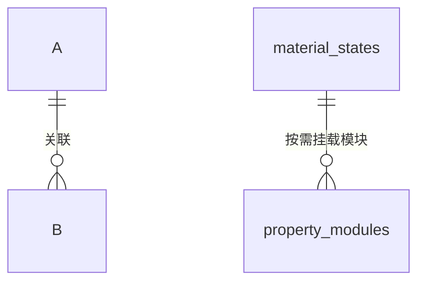
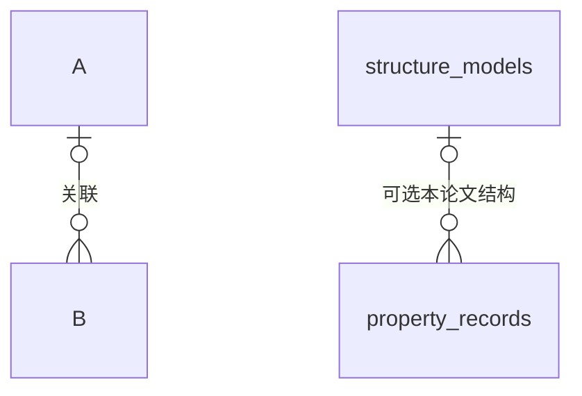
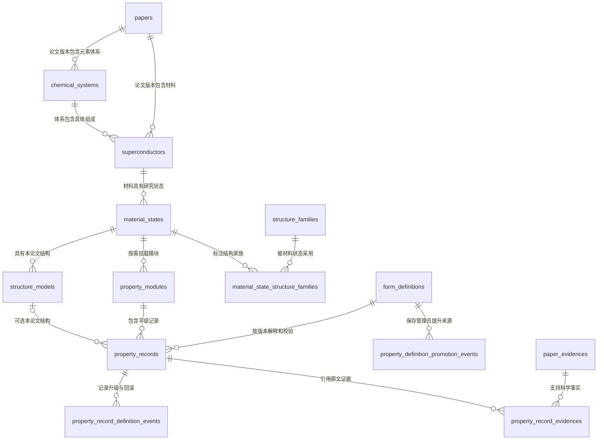
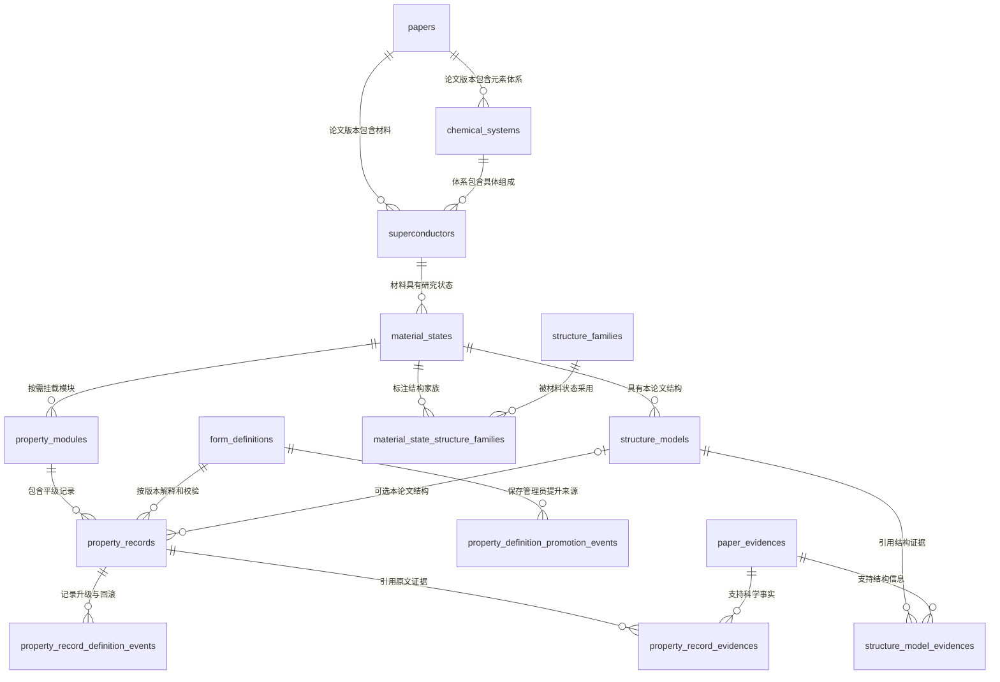
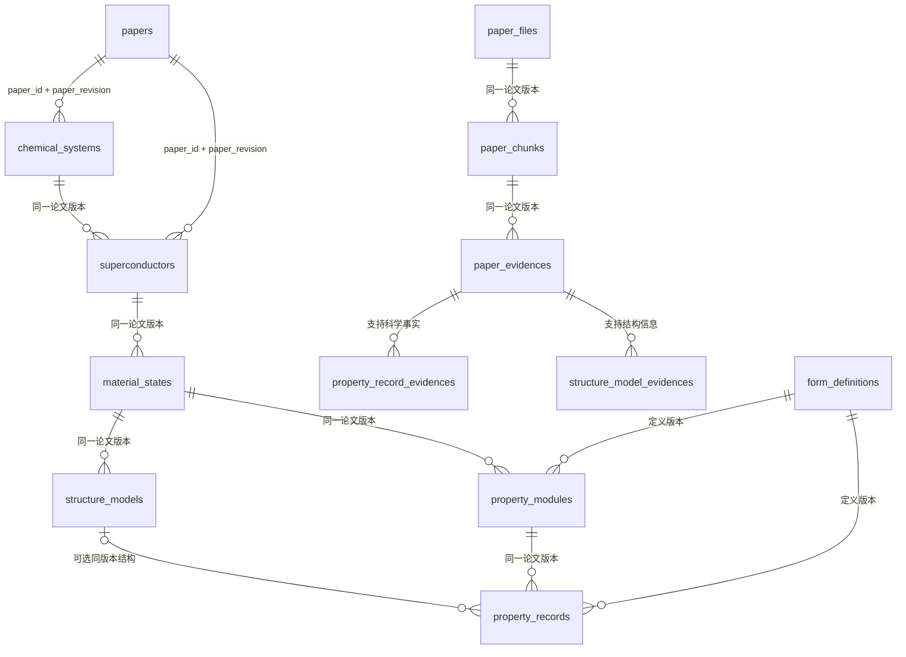
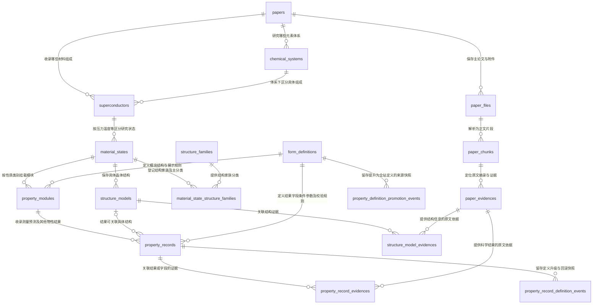
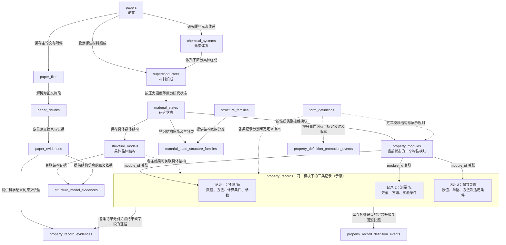
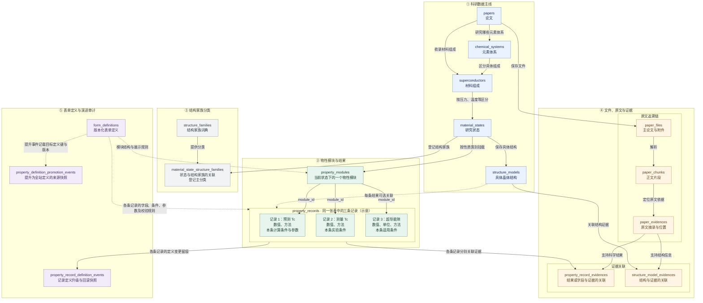
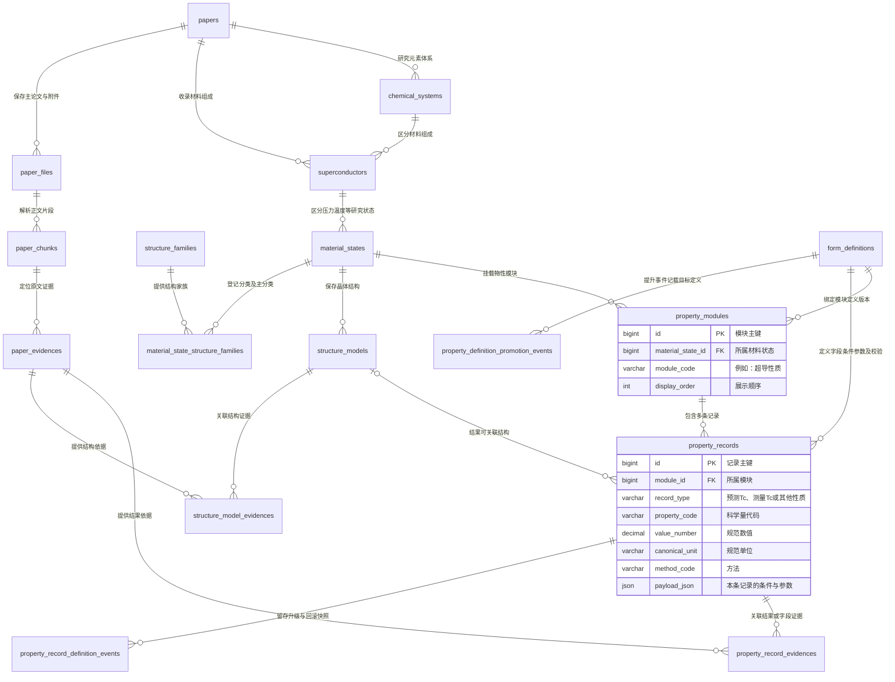

# 数据表关系图

## 目标关系

Mermaid ER 图的“基数”表示法，采用乌鸦脚记法：
o = 0，可选
| = 1
{ 或 } = 多

每条 B 必须属于一个 A (每个物性模块必须属于一个材料状态)
一条 A 可以没有 B，也可以拥有多条 B (一个材料状态可以有零个或多个物性模块)



每条 B 可以不关联 A，最多关联一个 A (一条 property_record 可以不指定结构，也可以指定一个 structure_model)
一条 A 可以没有 B，也可以关联多条 B (一个 structure_model 可以不被任何物性记录引用，也可以被多条物性记录引用)























图中的 `papers` 关系实际使用 `paper_id + paper_revision`。每条子记录都属于明确论文版本；图为便于  
阅读省略复合外键列。

## 从论文到物性的理解方式

```text
论文 A
└── H-La
    └── LaH10
        └── 170 GPa 状态
            ├── 结构等状态资料
            ├── 超导性质模块
            │   ├── 预测 Tc-A：250 K，Allen-Dynes
            │   │   ├── 本条 Conditions：k/q 网格、各自展宽、软件等
            │   │   ├── 本条参数：λ=2.2，ωlog=1100 K，μ*=0.10
            │   │   └── 本条证据、预留分组与新增字段
            │   ├── 预测 Tc-B：220 K，Allen-Dynes
            │   │   ├── 本条 Conditions：k/q 网格、各自展宽、软件等
            │   │   ├── 本条参数：λ=2.2，ωlog=1100 K，μ*=0.15
            │   │   └── 本条证据、预留分组与新增字段
            │   └── 测量 Tc：结果、方法、本条实验 Conditions、判据、证据
            └── 电子性质模块
                └── DOS 及其完整资料

论文 B
└── H-La
    └── LaH10                 # 与论文 A 的 LaH10 主键不同
        └── 170 GPa 状态
```

以上数字用于示意归属，不是论文数据或公式验算。A/B 条件和参数可重复；修改 A 不改变 B。

论文 A、B 可以通过规范化学式一起被搜索，但任何一方的修改和删除都不会改变另一方。

## 模块与记录

`property_modules` 是材料状态中的模块清单，`property_records` 保存实际科学事实。添加一个新模块不需要  
给 `material_states` 新增一列；发布相应模块和记录定义后即可挂载。记录只属于一个模块，非空模块不能  
在未显式处理记录时删除。

```text
MaterialState
└── PropertyModule(module_code=superconductive_properties)
    ├── PropertyRecord(record_type=predicted_tc)
    ├── PropertyRecord(record_type=measured_tc)
    └── PropertyRecord(property_code=hc2)
```

模块内部记录平级，每条记录内部可以分组。预测 Tc 把它采用的 μ*、λ、ωlog 放在自己的参数分组中，  
Conditions 放在自己的条件分组中；它们存入同一 `property_records.payload_json`，没有输入关系表。  
独立报告的其他物性仍可单独录入，但不会自动与 Tc 参数联动。

导出以一个 MaterialState 为单位，打包材料、状态、结构、各模块完整记录、证据和所用定义内容。  
用户下载后即可理解每条 Tc，不需要再导出关系表自行拼接。

## 定义与记录版本

```text
FormDefinition(predicted_tc, v1) <- 历史记录 A
FormDefinition(predicted_tc, v2) <- 新记录 B
```

v2 发布后不会改写 v1 或记录 A。只有显式升级操作才会把 A 转换并重新绑定到 v2。

自定义性质可以使用已发布通用模板随论文审核保留。管理员提升时发布独立的全站普通性质定义，并保存  
来源快照；不改写原 PropertyRecord，不创建跨论文共享记录。来源以审计快照保留，不使用阻止论文删除  
的反向外键，也不因论文删除而删除全站定义。


| 数据表 | 行数 | 一行表示什么 | 关键字段 |
|---|---:|---|---|
| `papers` | 1 | 一篇论文及其当前内容版本 | `doi`、`title`、`journal`、`year`、`authors`、`abstract`、`content_revision`、`approved_revision`、`review_status` |
| `chemical_systems` | 1 | 当前论文版本中的一个元素体系 | `paper_id`、`paper_revision`、`system_key`、`elements_list`、`element_count` |
| `superconductors` | 1 | 当前论文版本中的一种材料组成 | `chemical_system_id`、`chemical_formula`、`formula_normalized`、`composition_key`、`isotope_signature`、`composition`、`element_ratio` |
| `material_states` | 1 | 材料在特定压力、温度、结构分类等条件下的研究状态 | `superconductor_id`、`state_key`、压力、温度、磁场、`state_kind`、空间群、维度、晶系 |
| `structure_models` | 1 | 一个状态下的一份具体晶体结构 | `material_state_id`、`parent_structure_id`、`structure_format`、`structure_text`、`cell_parameters`、体积、原子数、计算方法 |
| `property_modules` | 1 | 某个状态下的一个物性模块 | `material_state_id`、`module_key`、`module_code`、`definition_key`、`definition_version`、`display_order` |
| `property_records` | 1 | 模块中的一条科学结果 | `module_id`、`record_type`、`property_code`、数值、单位、方法、判据、`payload_json`、定义版本 |