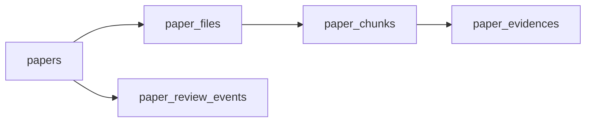

# 领域模型与数据库结构

## 功能说明

定义 SC-Wiki 主业务数据的实体、字段和关联关系，为 API、审核、检索和维护工具提供共同契约。

## 当前行为

- Alembic 的 fresh 链可在全新空 MySQL 创建 20 张目标业务表；`0007` 建立论文 revision、
  File、Chunk、Evidence 和审核事件约束，`0008` 建立条件化科学数据模型。
- SQLAlchemy `Base.metadata` 只包含目标表，不再把 `key_properties`、
  `superconductor_records` 或 `superconductors_structures` 纳入 fresh Schema。
- `MaterialState` 表达论文当前 revision 中的材料状态；`StructureModel`、
  `CalculationContext` 和 `ExperimentalContext` 分别表达结构、理论计算和实验测量上下文。
- `MaterialState.reported_space_group_symbol/number` 保存论文报告但没有完整结构几何时的空间群事实；只有存在真实结构文本时才创建 `StructureModel`，不会为凑必填字段伪造 CIF/POSCAR。
- `TcResult` 纵向保存每条 Tc；`PropertyDefinition` 和
  `SuperconductorProperty` 保存 Tc 之外的普通物性，表名为
  `superconductor_properties`，同时保留论文原文和可空规范值。
- 科学子实体没有独立审核状态。论文一次审核覆盖当前 revision 的 File、Chunk、Evidence、
  结构、Tc 和普通物性；只有 `approved_revision = content_revision` 才具备公开资格。
- Go 模型已经映射目标表；`KeyProperty` 仅保留为旧 Handler 的临时编译别名，实际表名仍是
  `superconductor_properties`。
- 两个现有运行 MySQL 保持原状，仍使用旧表和旧列。fresh 迁移有非空业务库 guard，不会
  自动读取、回填、转换或删除现有数据。

## 工作流程

目标模型由 Alembic、SQLAlchemy 和 GORM 共同描述。论文上传的 Python 提取、草稿编辑和提交事务已经切换到目标表；Go 搜索、RAG/Qdrant、图表、导入导出和公开网页仍未整体切换。

## 化学体系与具体材料的建模边界

- `chemical_systems` 与 `superconductors` 保持为两个独立实体，不合并、不重命名，也不移除两者之间的外键关系。
- `chemical_systems` 表示元素体系，例如 `H-La`；`superconductors` 表示具体化学计量材料，例如同一体系下的 `LaH3`、`LaH6` 和 `LaH10`。两者职责相近但数据粒度不同，维持一对多关系可以明确区分体系与具体材料。
- 当前不通过删除 `chemical_systems`、迁移外键或重写 ORM 与导入流程来简化表结构。现有关系继续服务体系归类、具体材料识别以及下游结构、物性和论文关联。

## 可推导字段的持久化策略

以下字段之间存在可计算关系，但项目有意将它们分别持久化，不在查询时强制重新计算，也不因存在推导关系而删除：

- `chemical_systems.elements_list`：体系层经过确认的元素集合。
- `chemical_systems.system_key`：体系层规范检索键，可由元素集合排序生成，但保留为显式字段。
- `superconductors.elements_list`：具体材料层经过确认的元素集合，与体系层字段语义和复核粒度不同。
- `superconductors.composition`：具体材料中各元素的计量组成。
- `superconductors.element_ratio`：具体材料的元素比例，可由 `composition` 归一化计算，但保留为显式字段。

例如 `LaH10` 可以机械解析为 `composition={"La": 1, "H": 10}`，再推导出 `elements_list=["H", "La"]`、`element_ratio={"La": 1/11, "H": 10/11}` 和体系键 `H-La`。但是含变量、混合占位、非整数计量或非标准写法的材料可能无法由程序可靠解析，机械结果也可能需要人工修订。因此上传和导入阶段应同时生成这些字段，并在入库前由人工检查和调整；读取阶段优先使用已经审核并持久化的结果，避免每次查询重复解析和计算。

重复字段在这里兼具查询缓存和人工校正快照的作用。自动一致性检查可以比较体系元素、材料元素、组成和比例，并报告异常，但不得在没有人工确认的情况下用重新计算结果覆盖已审核数据。发现差异时应保留原值和上下文，由审核流程判断是解析错误、录入错误，还是特殊化学式导致的合理差异。

## 论文、文件、切片、证据与审核事件边界

五张论文相关表表达不同粒度和生命周期，不属于应直接合并的重复表：

| 表 | fresh 目标职责 | 生命周期 |
| --- | --- | --- |
| `papers` | 出版信息、当前内容 revision 和一次整篇审核状态 | 稳定主实体 |
| `paper_files` | 当前 revision 的正文、补充材料或附件元数据 | 当前代文件清单 |
| `paper_chunks` | 当前 revision 中由文件派生的文本块 | 可重建当前代数据 |
| `paper_evidences` | 直接锚定当前 Chunk 的原文证据与定位快照 | 当前代审核证据 |
| `paper_review_events` | 一次整篇论文 revision 审核的不可变历史事件 | 审计历史 |

fresh 目标 Schema 已落实以下边界：

- `paper_files.stored_path` 是唯一文件路径来源，目标 `papers` 不含 `source_file_path`。
- 每个文件的 `chunk_index` 独立编号；Evidence 通过必填 `paper_chunk_id` 直接引用同论文、
  同 revision 的 Chunk。
- 每篇论文只保留一代 File/Chunk/Evidence。重新分块的目标契约是在同一 MySQL 事务中先按
  依赖删除旧当前代，再递增 revision 并写入完整新当前代；Qdrant 只保存可重建投影。
- `paper_review_events.paper_id` 单列外键指向论文并使用 `ON DELETE RESTRICT`。
  `paper_revision` 是历史快照，不与论文当前 revision 建组合外键，因此旧审核事件不阻止升版。

这些约束已经在隔离 fresh MySQL 验证，但上传、重分块、Qdrant 和公开查询业务流程尚未切换。

## 约束

- 当前 Docker 部署要求 `DATABASE_URL` 指向 MySQL；Python 仍保留 SQLite fallback 逻辑，但 Go 服务要求可解析的 MySQL DSN。
- GORM 与 SQLAlchemy 两套模型需要保持字段一致，否则会出现接口可读写范围不一致。
- RAG 向量数据位于 Qdrant，Neo4j 图数据由同步工具或 `graph.json` 快照支撑，不属于普通关系表字段。
- fresh 目标模型是新空库的 Schema 事实；现有运行库仍以实测旧 Schema 为事实来源。
- 运行数据库的逐表字段和关系以 [运行中 MySQL 表目录](mysql-schema-catalog.md) 的实测盘点为准。
- 可推导字段采用“上传时生成、入库前人工复核、读取时直接使用”的策略；不以运行时重复计算替代持久化字段。
- 一致性校验用于发现和提示差异，不自动覆盖人工确认的数据。

## 代码与测试

- `backend/models.py`
- `goserver/models/models.go`
- `backend/database.py`
- `goserver/database/db.go`
- `goserver/config/config.go`
- `alembic/versions/`
- `tests/02_maintenance_and_verification/`

## 相关变更记录

- [Feature #32：条件化结构、计算上下文与 Tc 结果数据模型](../../specs/32-superconducting-data-model/spec.md)
  已完成 fresh Schema、SQLAlchemy/GORM 和隔离 MySQL 验证；API/UI 和历史迁移未完成。
- [Feature #33：论文文件、证据与审核事件完整性收敛](../../specs/33-paper-lineage-integrity/spec.md)
  已完成 fresh Schema、SQLAlchemy/GORM 和隔离 MySQL 验证；RAG/Qdrant 编排和历史迁移未完成。
- [Feature #46：论文上传科学数据结构化](../../specs/46-upload-scientific-data-pipeline/spec.md)
  已完成上传草稿、编辑器和提交事务向条件化科学实体图的切换。

## 已知问题

- 两个现有运行数据库尚未部署 fresh Schema，也不在本次范围内迁移；其
  `key_properties`、`superconductors_structures` 和历史数据继续保持原状。
- 搜索、RAG/Qdrant、图表、导入导出和部分网页仍可能依赖旧表或旧字段，不能在这些调用方
  完成切换前把 fresh Schema 部署到运行库。
- 重新分块的单代事务和 Qdrant 删除后重建仅形成数据库契约，业务编排尚未实现。
- 普通物性网页展示“论文原文优先、规范值补充”的契约尚未切换到前端。
- `chemical_systems.elements_list` 与 `superconductors.elements_list` 存在有意保留的查询冗余；后续需要补充覆盖非标准化学式的人工复核和差异报告机制，但不通过合并表或删除字段解决。
- 现有数据库的未来迁移、调用方切换和部署必须另行设计并验收，不能直接运行本次仅支持空业务库
  的目标 revision。
