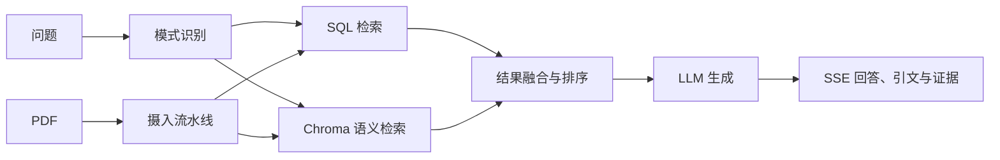

# RAG 文献助手

## 功能边界

该功能负责对独立超导文献数据执行结构化与语义检索，提供流式问答、证据和引文、PDF 摄入以及灵感探索。它不保证在缺少外部数据目录、向量库或 LLM 凭据时可用，也不直接替代主业务数据库。

## 小功能目录

| 小功能 | 职责 | 依赖 |
| --- | --- | --- |
| [可用性与配置](availability-and-configuration.md) | 管理数据、向量库和 LLM 能力开关 | `RAG_DATA_ROOT`、环境变量 |
| [混合检索](hybrid-retrieval.md) | 路由 SQL、向量和融合检索模式 | 异步数据库、Chroma |
| [流式问答与证据](streaming-qa-and-evidence.md) | 通过 SSE 返回回答、引文和证据事件 | 检索、LLM、React 会话状态 |
| [PDF 摄入](pdf-ingestion.md) | 校验并摄入上传的 PDF | 临时文件、摄入流水线 |
| [灵感探索](inspiration-exploration.md) | 生成想法卡片并执行可行性评审 | 检索证据、LLM reviewer |

## 功能组成

```text
RAG 文献助手
├── 可用性与配置
├── 混合检索
├── 流式问答与证据
├── PDF 摄入
└── 灵感探索
```

## 关联关系


