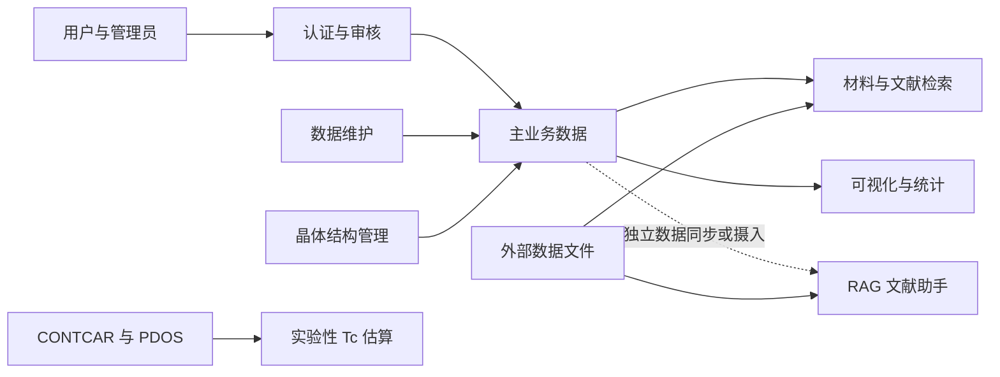

# SC-Wiki 当前功能总览

## 项目说明

SC-Wiki 是面向超导材料研究的数据检索与知识服务应用。当前代码以 FastAPI 提供 API 和单页应用托管，以 React 提供交互界面，并通过 SQLAlchemy 管理元素、材料、论文、超导物性记录、晶体结构和用户数据。

当前能力覆盖本地与外部材料检索、数据维护、晶体结构审核、用户与文献审核、统计可视化、RAG 文献助手和实验性 Tc 估算。部分能力依赖仓库外数据、第三方模型配置或仅提供后端 API，具体边界见各功能文档。

## 大功能目录

| 大功能 | 职责 | 主要依赖 |
| --- | --- | --- |
| [材料与文献检索](01-material-search-and-discovery/README.md) | 检索本地材料、论文、物性记录及外部候选数据，并提供分享导出与知识图谱查询 | 主业务数据库、Alexandria/HTSC-2025 数据文件 |
| [数据模型与维护](02-data-model-and-maintenance/README.md) | 维护领域模型、数据库初始化、迁移和离线导入导出 | SQLAlchemy、Alembic、SQLite/MySQL |
| [晶体结构管理](03-crystal-structure-management/README.md) | 校验、保存、审核和分发 CIF/POSCAR 结构 | 用户认证、主业务数据库、pymatgen |
| [认证与审核](04-authentication-and-review/README.md) | 处理注册登录、角色审批及论文和物性记录审核 | JWT、邮件服务、用户与论文模型 |
| [可视化与统计](05-visualization-and-metrics/README.md) | 展示 Tc 历史、压力关系和研究者贡献统计 | 已公开的超导物性记录、Chart.js |
| [RAG 文献助手](06-rag-literature-assistant/README.md) | 提供混合检索、流式问答、证据展示、PDF 摄入和灵感探索 | 独立 RAG 数据库、Chroma、LLM 配置 |
| [实验性 Tc 估算](07-experimental-tc-estimation/README.md) | 根据 CONTCAR 与 PDOS 文件计算实验性 Tc 估算和解释特征 | pymatgen、NumPy、上传文件 |

## 整体关系

主业务数据库是检索、审核、结构和统计能力的共同事实来源。RAG 使用独立的数据与向量存储，可读取相邻数据集，但其可用性不等同于主应用数据库可用。Tc 估算只处理用户上传的计算文件，不会自动回写主业务数据。

## 当前边界

- FastAPI 实际托管 `frontend_build/`；当前 `frontend/src/` 与部分后端 API 存在路径或流程不一致，源码页面不必然代表部署产物行为。
- RAG 依赖仓库外数据目录、Chroma 和 LLM API 配置，健康检查会分别报告检索与对话能力。
- 晶体结构后端 API 已实现，但当前 React 路由未发现对应的完整上传和审核界面。
- “研究者社区”目前只有贡献排行和公共图表证据，不包含帖子、评论或关注等论坛能力。
- Tc 估算由代码明确标记为实验页面，不构成模型科学有效性的保证。
- 仓库存在相关测试文件，但本次文档维护未运行测试，不声明测试已通过。

## 文档维护

本目录只记录当前代码、配置和测试文件能够支持的已落地事实。未来方案位于 `future-plan/`，不作为当前能力依据。无法从当前实现确认的内容在相应文档中标记为“待核验”。
