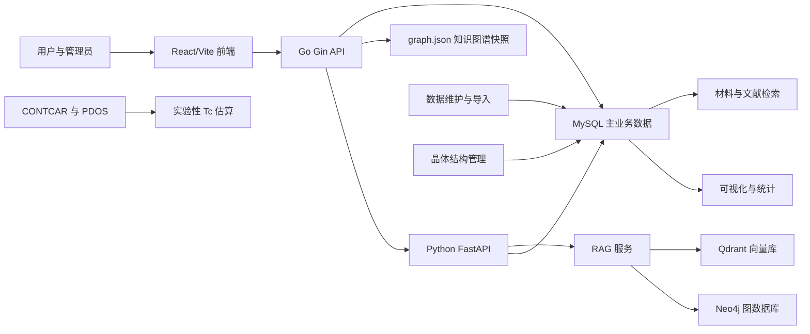

# SC-Wiki 当前功能总览

## 项目说明

SC-Wiki 是面向超导材料研究的数据检索与知识服务应用。当前代码以 React/Vite 提供单页应用，以 Go Gin 服务作为主要公开 API 聚合层，并将未覆盖的接口反向代理到 Python FastAPI 服务；数据库侧同时使用 GORM 与 SQLAlchemy 模型访问 MySQL 中的用户、论文、材料、物性记录、晶体结构、外部数据和图表组合数据。

当前能力覆盖热点资讯、本地与外部材料检索、论文上传与结构化富化、数据维护、晶体结构审核、用户与文献审核、统计可视化、图表组合、知识图谱、RAG 文献助手和实验性 Tc 估算。部分能力依赖 Docker 部署中的 MySQL、Redis、Neo4j、Qdrant、外部数据文件和 LLM/Embedding 配置，具体边界见各功能文档。

## 大功能目录

| 大功能 | 职责 | 主要依赖 |
| --- | --- | --- |
| [材料与文献检索](01-material-search-and-discovery/README.md) | 检索本地材料、论文、物性记录及 Alexandria/HTSC-2025 外部候选数据 | Go API、主业务数据库、外部数据表 |
| [数据模型与维护](02-data-model-and-maintenance/README.md) | 维护领域模型、数据库初始化、迁移、离线导入导出和 Docker 部署数据依赖 | GORM、SQLAlchemy、Alembic、MySQL |
| [晶体结构管理](03-crystal-structure-management/README.md) | 校验、保存、审核和分发 CIF/POSCAR 结构，并支持从物性记录读取结构文本 | 用户认证、主业务数据库、ASE |
| [认证与审核](04-authentication-and-review/README.md) | 处理注册登录、角色审批、论文编辑审核、用户管理和快讯管理 | JWT、bcrypt、管理员 API |
| [可视化与统计](05-visualization-and-metrics/README.md) | 展示 Tc 年代、压力关系、图表组合和管理统计 | key_properties、Recharts、缓存 |
| [RAG 文献助手](06-rag-literature-assistant/README.md) | 提供混合检索、流式问答、证据展示、PDF/TXT/MD 摄入和灵感探索 | Python FastAPI、MySQL、Qdrant、LLM 配置 |
| [实验性 Tc 估算](07-experimental-tc-estimation/README.md) | 根据 CONTCAR 与 PDOS 文件计算实验性 Tc 估算和解释特征 | pymatgen、NumPy、上传文件 |

## 整体关系

主业务数据库是检索、审核、结构、上传记录和统计能力的共同事实来源。Go 服务负责大部分用户可见 API、缓存和权限路由，未匹配请求转发到 Python 服务；Python 服务继续承担 RAG、结构 API、Tc 估算和 Neo4j 工具接口。Tc 估算只处理用户上传的计算文件，不会自动回写主业务数据。

## 当前边界

- Docker 部署入口使用 Nginx 前端、Go API、Python RAG、MySQL、Redis、Neo4j、Qdrant 七类服务；本地直接运行 Python FastAPI 时只包含 Python 注册的接口。
- `backend/main.py` 当前只 include `tc_predict`、`structures`、`rag`、`kg` 四类 Python 路由；Go 未注册的认证邮箱验证、图表组合导入/导出/复制/搜索等前端调用需按实际部署链路继续核验。
- RAG 已从 Chroma 迁移到 Qdrant 封装，但部分兼容命名仍保留 `chroma` 字样。
- 晶体结构后端 API 已实现，前端主要在论文编辑详情中展示 `key_properties.structure_text` 结构，完整结构审核工作台仍未从当前路由中确认。
- “社区”当前是公共图表、图表组合和论文详情抽屉，不包含帖子、评论或关注等论坛能力。
- Tc 估算由代码明确标记为实验页面，不构成模型科学有效性的保证。
- 仓库存在相关测试文件，但本次文档维护遵循 Overview Skill 未运行测试，不声明测试已通过。

## 文档维护

本目录只记录当前代码、配置和测试文件能够支持的已落地事实。未来方案位于 `future-plan/`，不作为当前能力依据。无法从当前实现确认的内容在相应文档中标记为“待核验”。
