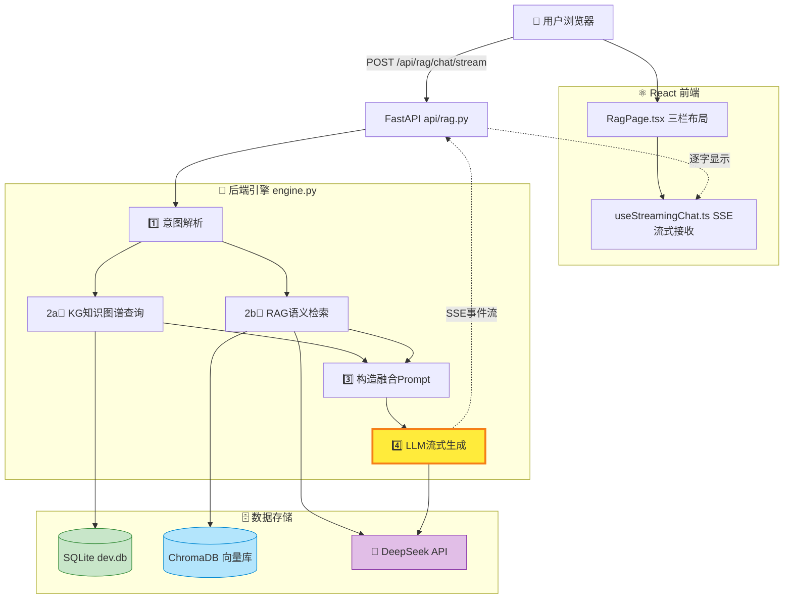
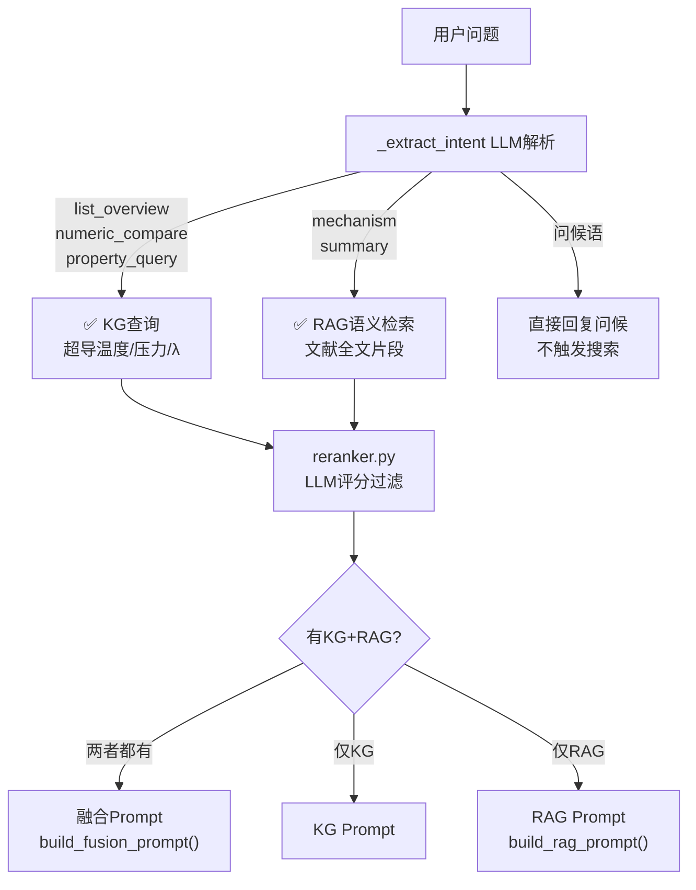
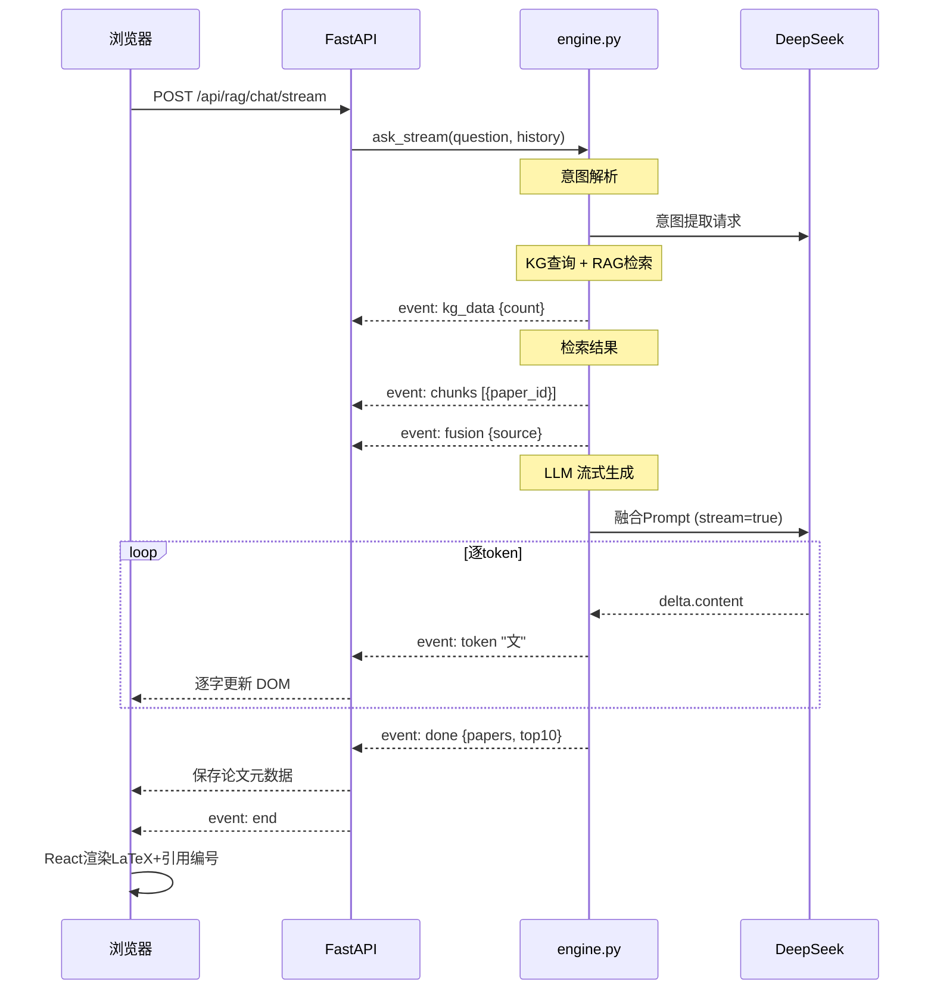
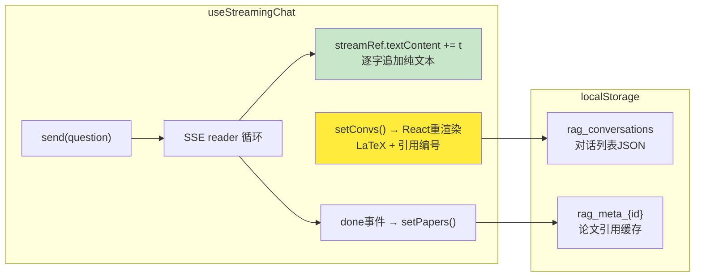
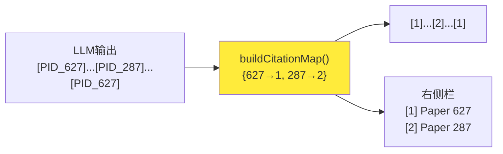

# RAG AI 文献助手 — 架构流程图

## 总览

```mermaid
graph TB
    U[👤 用户浏览器] -->|"POST /api/rag/chat/stream"| API["FastAPI api/rag.py"]

    subgraph 前端["⚛️ React 前端"]
        RP["RagPage.tsx 三栏布局"]
        UC["useStreamingChat.ts SSE流式接收"]
        RP --> UC
    end

    subgraph 后端["🐍 后端引擎 engine.py"]
        INTENT["1️⃣ 意图解析"]
        KGQ["2a️⃣ KG知识图谱查询"]
        RAGQ["2b️⃣ RAG语义检索"]
        PROMPT["3️⃣ 构造融合Prompt"]
        LLMG["4️⃣ LLM流式生成"]
    end

    subgraph 数据["🗄️ 数据存储"]
        SQLITE[("SQLite dev.db")]
        CHROMA[("ChromaDB 向量库")]
        DEEPSEEK["🤖 DeepSeek API"]
    end

    U --> RP
    API --> INTENT
    INTENT --> KGQ & RAGQ
    KGQ --> SQLITE
    RAGQ --> CHROMA
    RAGQ --> DEEPSEEK
    KGQ & RAGQ --> PROMPT
    PROMPT --> LLMG
    LLMG --> DEEPSEEK
    LLMG -.->|"SSE事件流"| API
    API -.->|"逐字显示"| UC

    style LLMG fill:#ffeb3b,stroke:#f57f17,stroke-width:3px
    style DEEPSEEK fill:#e1bee7,stroke:#7b1fa2
    style CHROMA fill:#b3e5fc,stroke:#0288d1
    style SQLITE fill:#c8e6c9,stroke:#388e3c
```

## 意图解析 → 路由策略

```mermaid
graph TB
    Q[用户问题] --> INTENT[_extract_intent LLM解析]
    INTENT -->|"list_overview<br/>numeric_compare<br/>property_query"| KG["✅ KG查询<br/>超导温度/压力/λ"]
    INTENT -->|"mechanism<br/>summary"| RAG["✅ RAG语义检索<br/>文献全文片段"]
    INTENT -->|"问候语"| GREET["直接回复问候<br/>不触发搜索"]

    KG --> RERANK["reranker.py<br/>LLM评分过滤"]
    RAG --> RERANK
    RERANK --> FUSION{"有KG+RAG?"}
    FUSION -->|"两者都有"| HYBRID["融合Prompt<br/>build_fusion_prompt()"]
    FUSION -->|"仅KG"| KG_ONLY["KG Prompt"]
    FUSION -->|"仅RAG"| RAG_ONLY["RAG Prompt<br/>build_rag_prompt()"]
```

## SSE 流式事件序列

```mermaid
sequenceDiagram
    participant Browser as 浏览器
    participant API as FastAPI
    participant Engine as engine.py
    participant LLM as DeepSeek

    Browser->>API: POST /api/rag/chat/stream
    API->>Engine: ask_stream(question, history)

    Note over Engine: 意图解析
    Engine->>LLM: 意图提取请求

    Note over Engine: KG查询 + RAG检索
    Engine-->>API: event: kg_data {count}

    Note over Engine: 检索结果
    Engine-->>API: event: chunks [{paper_id}]
    Engine-->>API: event: fusion {source}

    Note over Engine: LLM 流式生成
    Engine->>LLM: 融合Prompt (stream=true)
    loop 逐token
        LLM-->>Engine: delta.content
        Engine-->>API: event: token "文"
        API-->>Browser: 逐字更新 DOM
    end

    Engine-->>API: event: done {papers, top10}
    API-->>Browser: 保存论文元数据

    API-->>Browser: event: end
    Browser->>Browser: React渲染LaTeX+引用编号
```

## 前端数据流

```mermaid
graph LR
    subgraph localStorage
        CONV["rag_conversations<br/>对话列表JSON"]
        META["rag_meta_{id}<br/>论文引用缓存"]
    end

    subgraph useStreamingChat
        SEND["send(question)"]
        SSE["SSE reader 循环"]
        DOM["streamRef.textContent += t<br/>逐字追加纯文本"]
        DONE["done事件 → setPapers()"]
        FINAL["setConvs() → React重渲染<br/>LaTeX + 引用编号"]
    end

    SEND --> SSE
    SSE --> DOM
    SSE --> DONE
    DONE --> META
    FINAL --> CONV

    style DOM fill:#c8e6c9
    style FINAL fill:#ffeb3b
```

## 引用编号映射

```mermaid
graph LR
    RAW["LLM输出<br/>[PID_627]...[PID_287]...[PID_627]"] --> MAP["buildCitationMap()<br/>{627→1, 287→2}"]
    MAP --> DISPLAY["[1]...[2]...[1]"]
    MAP --> SIDEBAR["右侧栏<br/>[1] Paper 627<br/>[2] Paper 287"]

    style MAP fill:#ffeb3b
```

访问 https://mermaid.live 粘贴以上代码查看可交互的流程图。
