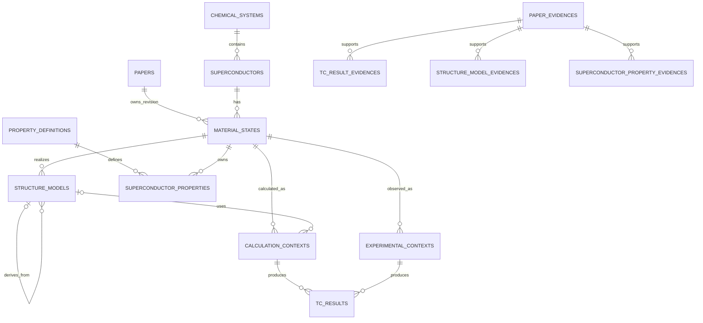

# 数据模型：全新空库的条件化超导数据

## 设计原则

1. 论文当前 revision 是审核与公开的唯一边界。
2. 组分、状态、结构、上下文、Tc 和普通物性分别建模。
3. 不以材料、压力、结构哈希或跨论文相似度建立科学身份。
4. 原文用于展示，规范值用于筛选与比较。
5. 组合外键保护论文和 revision 一致性。
6. 只面向空库，不包含历史映射、兼容列或回填状态。

## 关系总览



## 论文 revision

`papers` 由 #33 增加 `content_revision`、`approved_revision`。公开条件固定为：

```text
review_status = 'approved'
AND approved_revision = content_revision
```

文件、Chunk、Evidence 或科学内容变化时，事务内 revision 递增、整篇置 `pending`、
`approved_revision=NULL`，新版科学子记录全部使用新 `paper_revision`。子实体不含审核字段。

## 主数据

### `superconductors`

保留现有字段并增加：

| 字段 | 类型 | 规则 |
| --- | --- | --- |
| `composition_key` | `VARCHAR(255)` | 必填、唯一，含同位素的规范组分键 |
| `isotope_signature` | `VARCHAR(255)` | 可空同位素签名 |

`material_states` 不保存同位素。LaH10 与 LaD10 使用不同 `composition_key`。

## 科学实体

科学实体使用 `BIGINT` 自增主键；论文、用户和属性定义保持 `INT`。

### `material_states`

| 字段 | 类型 | 规则 |
| --- | --- | --- |
| `id` | `BIGINT` | 主键 |
| `paper_id`、`paper_revision` | `INT` | 必填 |
| `superconductor_id` | `INT` | 必填，删除受限 |
| `pressure_value_gpa` | `DECIMAL(14,6)` | 可空规范单值 |
| `pressure_min_gpa`、`pressure_max_gpa` | `DECIMAL(14,6)` | 可空范围 |
| `pressure_raw`、`pressure_unit_raw` | `VARCHAR(255/50)` | 可空原文 |
| `temperature_value_k` | `DECIMAL(14,6)` | 可空规范值 |
| `temperature_raw`、`temperature_unit_raw` | `VARCHAR(255/50)` | 可空原文 |
| `magnetic_field_t` | `DECIMAL(14,6)` | 可空 |
| `state_kind` | `VARCHAR(20)` | `theoretical/experimental/mixed/unknown` |
| `note` | `TEXT` | 可空 |

范围字段成对出现且 `min <= max`；数值非负。不得建立材料+压力唯一约束。
索引：论文 revision、材料+压力、论文+材料+物相。

### `structure_models`

| 字段 | 类型 | 规则 |
| --- | --- | --- |
| `id` | `BIGINT` | 主键 |
| `paper_id`、`paper_revision` | `INT` | 必填 |
| `material_state_id` | `BIGINT` | 必填，同论文 revision |
| `parent_structure_id` | `BIGINT` | 可空，同论文 revision、同组分 |
| `space_group_symbol/number` | `VARCHAR(100)/SMALLINT` | 可空，编号 1–230 |
| `structure_format` | `VARCHAR(20)` | 必填 |
| `structure_text` | `LONGTEXT` | 必填 |
| `structure_hash` | `CHAR(64)` | 必填，只建普通索引 |
| `cell_parameters` | `JSON` | 可空 |
| `volume_angstrom3` | `DECIMAL(20,8)` | 可空、非负 |
| `atom_count` | `INT` | 可空、非负 |
| `geometry_method` | `VARCHAR(100)` | 可空 |
| `nuclear_treatment` | `VARCHAR(32)` | 必填 |
| `exchange_correlation/calculation_code` | `VARCHAR(100)` | 可空 |
| `method_parameters` | `JSON` | 可空 |
| `source_locator` | `VARCHAR(500)` | 可空 |

本表不含 `phase_label`。核处理支持 `classical_static/harmonic/quasi_harmonic/
anharmonic_classical/anharmonic_quantum/experimental/unknown`。数据库阻止自引用，
服务层阻止任意深度循环。

### `calculation_contexts`

必填：`paper_id`、`paper_revision`、`material_state_id`、`phonon_nuclear_treatment`。
可空：同 revision 的 `structure_id`，以及电子方法、交换关联、赝势、SOC、声子方法、EPC
方法、μ*、λ、ωlog、k/q 网格、能量截断、程序和 JSON 扩展参数。`structure_id` 为空时
`missing_structure_reason` 必填。数值参数使用固定精度并限制非负。

### `experimental_contexts`

必填：`paper_id`、`paper_revision`、`material_state_id`、`tc_criterion`。
可空：同 revision 的 `structure_id`、样品、制备、测量方法、外场、压力不确定度和 JSON。
判据支持 `resistance_onset/resistance_midpoint/zero_resistance/magnetic_susceptibility/
specific_heat/author_reported/unknown`。

### `tc_results`

| 字段 | 类型 | 规则 |
| --- | --- | --- |
| `id` | `BIGINT` | 主键 |
| `paper_id`、`paper_revision` | `INT` | 必填 |
| `material_state_id` | `BIGINT` | 必填 |
| `calculation_context_id` | `BIGINT` | 理论结果必填 |
| `experimental_context_id` | `BIGINT` | 实验结果必填 |
| `result_kind`、`tc_method` | `VARCHAR(16/64)` | 必填 |
| `tc_value_k` | `DECIMAL(20,8)` | 可空单值 |
| `tc_min_k`、`tc_max_k` | `DECIMAL(20,8)` | 可空范围 |
| `uncertainty_k` | `DECIMAL(20,8)` | 可空、非负 |
| `value_raw`、`unit_raw` | `VARCHAR(255/50)` | 必填论文原文 |
| `source_locator` | `VARCHAR(500)` | 可空 |
| `source_fingerprint` | `CHAR(64)` | 必填 |
| `is_representative` | `BOOLEAN` | 默认 false |
| `representative_marker` | 生成列 | 代表结果为 1，否则 NULL |

理论结果只关联理论上下文；实验结果只关联实验上下文且方法为 `experimental`。
单值或完整范围至少一种，范围 `min <= max`。唯一约束：

- `(paper_id, paper_revision, source_fingerprint)`；
- `(paper_id, material_state_id, tc_method, representative_marker)`，利用 NULL 可重复语义保证
  每组最多一条代表结果。

### `property_definitions`

字段：`id`、唯一稳定 `code`、`display_name`、可空 `canonical_unit`、
`value_kind(number/range/text/boolean)`、description、`is_active`。保留代码
`critical_temperature`、`tc` 和 Tc 方法名不得注册为普通物性。

### `superconductor_properties`

| 字段 | 类型 | 规则 |
| --- | --- | --- |
| `id` | `BIGINT` | 主键 |
| `paper_id`、`paper_revision` | `INT` | 必填 |
| `material_state_id` | `BIGINT` | 必填 |
| `structure_id`、`calculation_context_id` | `BIGINT` | 可空，同 revision |
| `property_definition_id` | `INT` | 必填 |
| `name_raw` | `VARCHAR(255)` | 必填原始属性名 |
| `value_raw` | `TEXT` | 必填原始值 |
| `unit_raw` | `VARCHAR(100)` | 可空原始单位 |
| `value_number` | `DECIMAL(30,12)` | 可空规范单值 |
| `value_min`、`value_max` | `DECIMAL(30,12)` | 可空规范范围 |
| `canonical_unit` | `VARCHAR(50)` | 可空规范化快照 |
| `condition_note` | `TEXT` | 可空 |
| `source_fingerprint` | `CHAR(64)` | 必填 |

范围成对且 `min <= max`。唯一约束 `(paper_id, paper_revision, source_fingerprint)`。

## Evidence 连接

```text
tc_result_evidences(
  tc_result_id, paper_evidence_id, paper_id, paper_revision, evidence_role
)
structure_model_evidences(
  structure_id, paper_evidence_id, paper_id, paper_revision, evidence_role
)
superconductor_property_evidences(
  superconductor_property_id, paper_evidence_id, paper_id, paper_revision, evidence_role
)
```

各表以科学实体 ID + Evidence ID 为联合主键；组合外键校验两端 `paper_id + paper_revision`，
拒绝跨论文和跨 revision 证据。

## 删除与公开

- 科学实体到论文、组分、状态、结构和上下文默认 `ON DELETE RESTRICT`。
- Evidence 连接行可随任一端删除，但不得级联删除科学实体或 Evidence。
- revision 改变时不保留多代科学内容；事务替换当前代并使论文 `pending`。
- 公开查询从 `papers` 过滤当前已批准 revision，不读取子实体审核字段。
