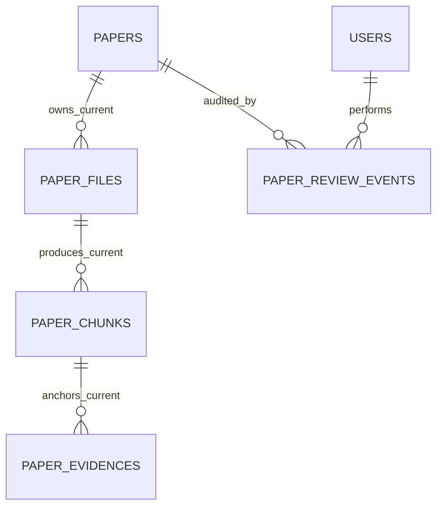
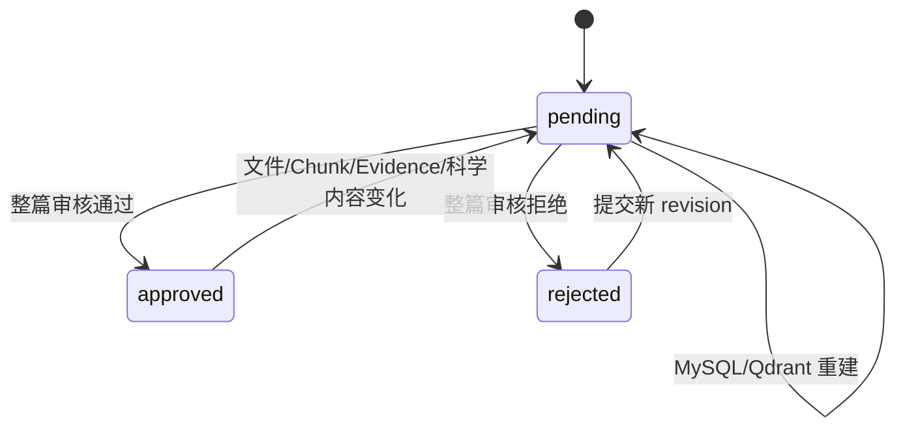

# 数据模型：全新空库的单代论文血缘

## 设计原则

1. 五表保持独立，MySQL 是当前内容权威。
2. `paper_files.stored_path` 是唯一文件路径来源。
3. 文件、Chunk、Evidence 只保存论文当前 revision。
4. Evidence 直接引用 Chunk，同时保存审核快照。
5. 组合外键阻止跨论文和跨 revision 关系。
6. 本模型不包含历史兼容列、回填状态或多代内容。

## 关系总览



## `papers`

新增或收敛字段：

| 字段 | 类型 | 规则 |
| --- | --- | --- |
| `content_revision` | `INT` | 必填，默认 1，当前内容代 |
| `approved_revision` | `INT` | 可空，审核通过时等于当前 revision |
| `review_status` | `VARCHAR(50)` | `pending/approved/rejected` |
| `reviewed_by_user_id`、`reviewed_at` | 现有类型 | 当前审核结果快照 |

目标表不包含 `source_file_path`。

检查约束：

```text
content_revision >= 1
approved_revision IS NULL OR approved_revision <= content_revision
review_status = 'approved' -> approved_revision = content_revision
review_status != 'approved' -> approved_revision IS NULL
```

论文当前公开条件是 `review_status='approved' AND approved_revision=content_revision`。

## `paper_files`

| 字段 | 类型 | 规则 |
| --- | --- | --- |
| `id` | `INT` | 主键 |
| `paper_id`、`paper_revision` | `INT` | 必填，当前论文 revision |
| `role` | `VARCHAR(20)` | `main/supplementary/attachment` |
| `original_filename` | `VARCHAR(500)` | 必填 |
| `stored_path` | `VARCHAR(500)` | 必填，唯一路径来源 |
| `sha256` | `CHAR(64)` | 必填 |
| `size` | `BIGINT` | 必填，非负 |
| `media_type` | `VARCHAR(100)` | 可空 |
| `sort_order` | `INT` | 必填，非负 |
| `main_marker` | 生成列 | main 为 1，否则 NULL |
| `created_at` | `DATETIME` | 必填 |

唯一约束：

- `(paper_id, sort_order)`；
- `(paper_id, stored_path)`；
- `(paper_id, main_marker)`：依赖 NULL 可重复语义，保证同论文最多一个 main；
- `(id, paper_id, paper_revision)`：供组合外键引用。

草稿可没有 main；提交和审核事务必须验证 main 数量等于 1。

## `paper_chunks`

| 字段 | 类型 | 规则 |
| --- | --- | --- |
| `id` | `INT` | 主键 |
| `paper_id`、`paper_revision` | `INT` | 必填 |
| `paper_file_id` | `INT` | 必填 |
| `chunk_index` | `INT` | 必填，非负 |
| `section_name`、`heading` | `VARCHAR(500)` | 可空 |
| `content` | `LONGTEXT` | 必填 |
| `token_count` | `INT` | 可空，非负 |
| `page_start`、`page_end` | `INT` | 可空，正数且范围有效 |
| `created_at` | `DATETIME` | 必填 |

组合外键：

```text
(paper_file_id, paper_id, paper_revision)
  -> paper_files(id, paper_id, paper_revision)
  ON DELETE RESTRICT
```

唯一约束：`(paper_file_id, chunk_index)`。revision 不进入该唯一键，因此同一文件不能保留两代
相同编号 Chunk。

## `paper_evidences`

| 字段 | 类型 | 规则 |
| --- | --- | --- |
| `id` | `INT` | 主键 |
| `paper_id`、`paper_revision` | `INT` | 必填 |
| `paper_chunk_id` | `INT` | 必填 |
| `field_path` | `VARCHAR(255)` | 必填 |
| `section` | `VARCHAR(500)` | 可空快照 |
| `page_start`、`page_end` | `INT` | 可空快照 |
| `quote` | `LONGTEXT` | 必填快照 |
| `created_at` | `DATETIME` | 必填 |

组合外键：

```text
(paper_chunk_id, paper_id, paper_revision)
  -> paper_chunks(id, paper_id, paper_revision)
  ON DELETE RESTRICT
```

本表不重复保存 `paper_file_id` 或 `chunk_index`。文件和编号通过 Chunk 解析。

## `paper_review_events`

| 字段 | 类型 | 规则 |
| --- | --- | --- |
| `id` | `INT` | 主键 |
| `paper_id` | `INT` | 必填，外键 `ON DELETE RESTRICT` |
| `paper_revision` | `INT` | 必填，被审核内容的不可变历史快照 |
| `reviewer_user_id` | `INT` | 必填，外键 `ON DELETE RESTRICT` |
| `status` | `VARCHAR(50)` | `pending/approved/rejected` |
| `review_comment` | `TEXT` | 可空 |
| `reviewed_at` | `DATETIME` | 必填 |
| `request_id` | `VARCHAR(64)` | 可空、唯一 |
| `source` | `VARCHAR(20)` | 必填 |

审核事件不可更新；同一 request ID 重试不得产生第二条事件。`paper_id` 单列外键指向
`papers.id`；`paper_revision` 不与 `papers.content_revision` 建立组合外键，因此论文升版
不会改写或锁死旧审核历史。

## 当前代替换状态机



重新分块顺序：

1. 单个 MySQL 事务：清空 `approved_revision` 并将论文置为 `pending`，此时仍保持旧 revision。
2. 同一事务：按外键依赖顺序删除旧当前代 Evidence 连接、科学内容、Evidence、Chunk 和 File。
3. 同一事务：递增论文 revision，写入同一新 revision 的 File、Chunk、Evidence 和科学内容后提交。
4. 索引：按 `paper_id` 删除 Qdrant 旧 points，写入携带当前 revision 的新 points。
5. 完整性检查：MySQL、Qdrant revision 和数量一致；索引失败时论文保持 `pending`。
6. 人工审核：一次批准整篇当前 revision。

失败时论文保持 `pending`。系统不保留第二代 Chunk/Evidence 作为回退；可重新执行可重建流程。

## 删除与索引规则

- `paper_review_events.paper_id` 使用 `ON DELETE RESTRICT`。
- 文件存在 Chunk 时限制删除；Chunk 存在 Evidence 时限制删除。
- 当前代替换必须按完整外键依赖顺序显式删除，审核事件不参与删除且继续保存历史快照。
- Qdrant point 必须携带 `paper_id`、`paper_revision`、`paper_chunk_id`，查询时校验当前 revision。
- `paper_id + paper_revision`、文件顺序、Chunk 唯一键和 Evidence Chunk 外键均建立索引。
