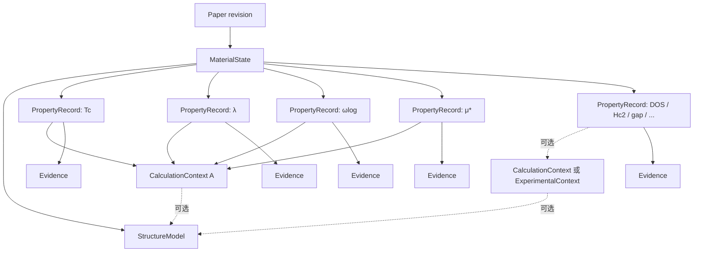

# 数据模型：平级超导物性记录

## 1. 权威结论

`MaterialState` 下只有一个物性集合：`SuperconductorProperties[]`。集合中的每一项都是平级
`SuperconductorPropertyRecord`。Tc、λ、ωlog、μ*、DOS、Hc1/Hc2、超导能隙、临界电流、
穿透深度、相干长度和 energy above hull 等都使用这一个记录概念。

本模型不使用以下分组：

- `TcRelated`
- `TheoreticalTcRecords`
- `ExperimentalTcRecords`
- `OtherProperties`
- `NonTcProperties`
- `UncontextualizedProperties`

“平级”表示物性之间没有容器关系，不表示它们彼此没有科学关联。同一次计算或实验产生的多条
记录通过共享 Context 建立关系。

## 2. 完整领域结构

```text
PaperRevision
└── MaterialStates[]
    └── MaterialState
        ├── MaterialIdentity
        │   ├── chemical_formula
        │   └── material_state_id
        ├── StateConditions
        │   ├── pressure
        │   ├── temperature
        │   └── reported_space_group
        ├── StructureModels[]
        └── SuperconductorProperties[]
            └── SuperconductorPropertyRecord
                ├── record_key
                ├── property_code
                ├── name_raw
                ├── value_kind
                ├── value_raw
                ├── value_number
                ├── value_min / value_max
                ├── uncertainty
                ├── unit_raw / canonical_unit
                ├── method_raw（可选，结果专属）
                ├── criterion（可选，结果专属）
                ├── condition_note
                ├── structure_ref（可选）
                ├── context（可选）
                │   ├── context_key
                │   ├── kind = calculation | experimental
                │   ├── structure_ref（可选）
                │   ├── calculation_details（kind=calculation）
                │   └── experimental_details（kind=experimental）
                ├── tc_method（仅 property_code=tc）
                ├── tc_method_custom（仅 property_code=tc 且方法为 other）
                ├── result_kind（仅 property_code=tc，只读推导）
                ├── is_representative（仅 property_code=tc）
                └── evidences[]
```

## 3. 关系图



图中的 Context 是关联节点，不是物性分组。页面可以按录入顺序显示所有记录，也可以为帮助
理解而显示“来自同一次计算”的提示，但不得把记录重新移动到互斥类别中。

## 4. `SuperconductorPropertyRecord`

### 4.1 公共字段

| 字段 | 必填 | 含义与约束 |
| --- | --- | --- |
| `record_key` | 是 | 草稿/API 内稳定标识；由系统产生，不要求用户输入，不等同于数据库主键 |
| `property_code` | 是 | 规范物性代码，例如 `tc`、`lambda_ep`、`omega_log`、`mu_star`、`dos_fermi`、`hc2`、`superconducting_gap`、`energy_above_hull`；自定义项由系统生成稳定的 `custom:<slug>` |
| `name_raw` | 是 | 论文原文物性名称，不被规范代码覆盖 |
| `value_kind` | 是 | `number`、`range`、`text` 或 `boolean`；布尔值在当前范围内以 `value_raw=true/false` 规范表达，不新增专用列 |
| `value_raw` | 是 | 论文中的原始值文本 |
| `value_number` | 条件必填 | 单值的规范数值；不适用于纯文本或范围 |
| `value_min`、`value_max` | 条件必填 | 范围必须成对，且 `value_min <= value_max` |
| `uncertainty` | 否 | 非负不确定度；Tc 使用 K，其他物性与规范单位一致 |
| `unit_raw` | 否 | 论文原始单位 |
| `canonical_unit` | 否 | 规范单位；缺少可靠换算时为空 |
| `method_raw` | 否 | 论文对这条结果使用的方法原文；只属于当前记录，不代替共享 Context 的方法条件 |
| `criterion` | 否 | 这条结果的判据；实验 Tc 使用既有规范判据，Hc2、能隙等可保留原文判据 |
| `condition_note` | 否 | 无法结构化但必须保留的条件说明 |
| `structure_ref` | 否 | 直接适用的结构；存在 Context 且 Context 也引用结构时必须一致 |
| `context` | 否 | 产生该记录的计算或实验条件；未知时为空 |
| `evidences` | 是 | Evidence 集合；草稿阶段可为空，新批准数据遵守证据门槛 |

### 4.2 Tc 专用字段

Tc 不是子集合，而是 `property_code=tc` 的普通集合成员。只有该代码启用以下字段：

| 字段 | 必填 | 约束 |
| --- | --- | --- |
| `tc_method` | 是 | `experimental`、`anisotropic_eliashberg`、`isotropic_eliashberg`、`allen_dynes`、`mcmillan`、`scdft`、`other`；`unknown` 仅允许旧数据读取或草稿暂存，正式提交前必须明确 |
| `tc_method_custom` | 条件必填 | `tc_method=other` 时填写；其他方法必须为空 |
| `result_kind` | 只读 | 由 `tc_method` 推导为 `theoretical` 或 `experimental`；新写入不得让它成为第二个权威 |
| `is_representative` | 是 | 默认 `false`；同论文 revision、材料状态和方法最多一条为 `true` |

`property_code != tc` 时，上述字段必须为空。Tc 值仍使用公共的 `PropertyValue` 字段，不再另建
一套嵌套值对象。

## 5. `PropertyContext`

### 5.1 公共字段

| 字段 | 必填 | 含义与约束 |
| --- | --- | --- |
| `context_key` | 是 | 同一草稿或响应内的稳定关联键，由系统管理，不是数据库 ID |
| `kind` | 是 | `calculation` 或 `experimental` |
| `structure_ref` | 否 | 本次计算或实验使用的结构 |
| `missing_structure_reason` | 条件必填 | 计算 Context 没有结构时必填；实验 Context 不强制 |

同一 `context_key` 可出现在多条物性记录中。所有出现位置的 `kind` 和详情必须一致；不一致时
整个请求失败，并返回冲突记录的字段路径。

### 5.2 计算详情

`kind=calculation` 时可包含：

- `electronic_method`
- `exchange_correlation`
- `pseudopotential_type`
- `pseudopotential_name`
- `spin_orbit_coupling`
- `phonon_method`
- `phonon_nuclear_treatment`
- `epc_method`
- `k_grid`
- `q_grid`
- `energy_cutoff_value`
- `energy_cutoff_unit`
- `calculation_code`
- `parameters`

λ、ωlog、μ* 不在计算详情中。它们是与 Context 关联的平级物性记录。

### 5.3 实验详情

`kind=experimental` 时可包含：

- `sample_label`
- `sample_preparation`
- `measurement_method`
- `applied_field_t`
- `pressure_uncertainty_gpa`
- `parameters`

实验 Context 只保存可共享的样品和测量条件。Tc、Hc2、超导能隙等各自的结果判据位于对应
`SuperconductorPropertyRecord.criterion`；仅在 `property_code=tc` 时进一步执行 #84 的
Tc 方法互斥和判据枚举规则。

## 6. 平级记录示例

同一 LaH10 材料状态包含两组理论计算和一组实验：

```text
CalculationContext calc-a
├── μ* = 0.10
├── λ = 2.20
├── ωlog = 1100 K
└── Tc = 250 K（Allen-Dynes，代表结果）

CalculationContext calc-b
├── μ* = 0.15
└── Tc = 220 K（Allen-Dynes）

ExperimentalContext exp-a
├── Tc = 245 K（zero resistance）
├── Hc2 = 120 T
└── superconducting gap = 40 meV

无明确 Context
├── DOS at EF = 0.8 states/eV
└── energy above hull = 0 eV/atom
```

上述文本仅用于展示关联。规范结构仍是一组平级记录：

```text
SuperconductorProperties[]
├── { property_code: mu_star, context_key: calc-a }
├── { property_code: lambda_ep, context_key: calc-a }
├── { property_code: omega_log, context_key: calc-a }
├── { property_code: tc, context_key: calc-a }
├── { property_code: mu_star, context_key: calc-b }
├── { property_code: tc, context_key: calc-b }
├── { property_code: tc, context_key: exp-a }
├── { property_code: hc2, context_key: exp-a }
├── { property_code: superconducting_gap, context_key: exp-a }
├── { property_code: dos_fermi, context: null }
└── { property_code: energy_above_hull, context: null }
```

## 7. 验证规则

### 7.1 通用规则

1. 所有记录属于一个明确 `MaterialState` 和论文 revision。
2. `value_raw` 不得为空；规范值可以为空。
3. `number` 需要 `value_number`，`range` 需要完整上下界，`text/boolean` 使用规范 `value_raw` 表达。
4. Context 最多一种；不得同时声明计算和实验详情。
5. 记录和 Context 的结构引用如果同时存在，必须相同。
6. 同名、同值记录只有在来源指纹也相同时才视为重复；不同 Context 下的同值记录必须保留。
7. Evidence 只能指向同一论文 revision 的有效 Chunk。

### 7.2 Tc 规则

1. `tc_method=experimental` 时：`result_kind=experimental` 且 Context 必须为 `experimental`。
2. 其他已知 `tc_method`：`result_kind=theoretical` 且 Context 必须为 `calculation`。
3. `tc_method=unknown` 只允许兼容读取或草稿暂存，正式提交和批准前必须选择明确方法。
4. 实验 Tc 的 `criterion` 必须属于既有规范判据之一，可使用 `unknown` 表示论文未明确报告。
5. 实验 Tc 不得通过任何兼容字段携带 λ、ωlog、μ*。
6. 每个论文 revision、材料状态和 Tc 方法最多一条代表记录。
7. `superconductor_kind` 不参与上述判断。

### 7.3 Context 规则

1. Context 不得跨材料状态或 revision 共享。
2. 计算 Context 无结构时必须保存 `missing_structure_reason`。
3. 同一 `context_key` 的所有详情必须一致。
4. 删除最后一个关联记录时可删除孤立 Context；仍被其他记录引用时不得删除。

## 8. 领域模型与物理存储的映射

统一领域记录不要求一张数据库宽表。确定的持久化映射如下：

| 领域记录 | 物理存储 | Evidence 存储 | 说明 |
| --- | --- | --- | --- |
| `property_code=tc` | `tc_results` | `tc_result_evidences` | 保留 Tc 方法、代表结果和专用索引/约束 |
| 其他全部代码，包括 λ、ωlog、μ* | `superconductor_properties` + `property_definitions` | `superconductor_property_evidences` | 统一使用原始值和规范值模型 |
| `context.kind=calculation` | `calculation_contexts` | 由各物性自己的 Evidence 表达 | Context 只保存方法和条件，不再拥有 λ、ωlog、μ* 权威值 |
| `context.kind=experimental` | `experimental_contexts` | 由各物性自己的 Evidence 表达 | 允许 Tc 以外物性关联实验 Context |
| `structure_ref` | `structure_models` | `structure_model_evidences` | 结构与物性保持独立实体 |

由单一映射层完成读写：上层只处理 `SuperconductorPropertyRecord`，不得根据数据库表名重新
建立业务分组。

## 9. 必要的 Schema 演进

本 Feature 不合并数据库表，但为了让平级模型成为真实单一来源，需要以下定点调整：

1. 为 `superconductor_properties` 增加可空 `experimental_context_id`、`method_raw` 和 `criterion`，并约束计算/实验 Context 最多一个。
2. 为 λ、ωlog、μ* 建立规范 `property_definitions`。
3. 将 `calculation_contexts.lambda_ep`、`omega_log_k`、`mu_star` 的现有非空值回填成通用物性记录，并保留其 Context 关系。
4. 为 `tc_results` 增加结果级 `criterion`，把旧 `experimental_contexts.tc_criterion` 复制到关联实验 Tc 后移除 Context 的 Tc 专属列。
5. 同一迁移在回填和计数核验成功后移除三个计算参数列和实验 Context 的 Tc 判据列；任一步失败则整个迁移回滚，禁止留下双重权威来源。
6. 保留 `tc_results` 与两类 Context 的复合外键及 #84 的 `ck_tc_results_context_kind` 等价约束。
7. 更新删除拓扑，使通用物性在 Context 之前删除，Evidence 在物性之前删除。

### 历史 Evidence 边界

旧 `CalculationContext` 的 λ、ωlog、μ* 不一定有独立 Evidence 连接。迁移只能迁移已存在的
事实和可验证关联，不能把 Tc 的 Evidence 自动冒充成参数 Evidence。迁移必须：

- 为每个回填值生成确定性来源指纹，并保留原 Context 与论文 revision；
- 只迁移实际非空值，不补造数值；
- 有明确参数 Evidence 时建立对应连接；
- 无法恢复 Evidence 时保留空 Evidence 集合并输出逐条迁移报告，不静默声称证据完整；
- 不因历史证据缺口自动改变已批准论文状态，后续编辑和重新批准时按当前证据规则处理。

downgrade 只根据迁移生成的确定性来源指纹恢复原有 Context 参数列并删除对应迁移生成行；
迁移前已经存在以及新版本后来创建的通用物性行不得被 downgrade 删除。

## 10. 兼容转换

读取边界接受以下旧来源：

```text
material_states[].tc_results[]
material_states[].calculation_contexts[]
material_states[].experimental_contexts[]
material_states[].properties[]
paper.key_properties[]
```

转换规则：

1. 每条旧 Tc 转成 `property_code=tc`。
2. 每个旧计算 Context 的非空 λ、ωlog、μ* 各转成一条平级记录，并共享该 Context。
3. 每条旧 `properties` / `key_properties` 转成相应 `property_code` 记录。
4. 同一物理行已由新通用物性记录表达时，不再从旧 Context 字段生成第二条记录。
5. 新草稿保存和详情响应只输出 `superconductor_properties[]`。

## 11. 被替代与保留的既有约束

| 来源 | 处理 |
| --- | --- |
| #32 “Tc 不进入普通物性字典” | 物理存储层继续保留；领域层不再把 Tc 排除在 `SuperconductorProperties` 外 |
| #46 Tc/Context/普通物性分流草稿 | 被统一平级草稿替代；持久化适配仍可分流到专用表 |
| #52 每条 Tc 的计算参数嵌套 | 物性嵌套被替代；逐条结果的 Context 关系保留 |
| #57/#65 三来源读取和展示拼装 | 被正式统一投影替代；完整可见的验收结果保留 |
| #76 共享材料状态编辑器 | 保留并改造，不建立第二套编辑器 |
| #80 论文级超导类型控制字段 | 该控制职责被 #84 取代；只保留论文分类所有权 |
| #84 `tc_method` 上下文互斥 | 完整保留 |
