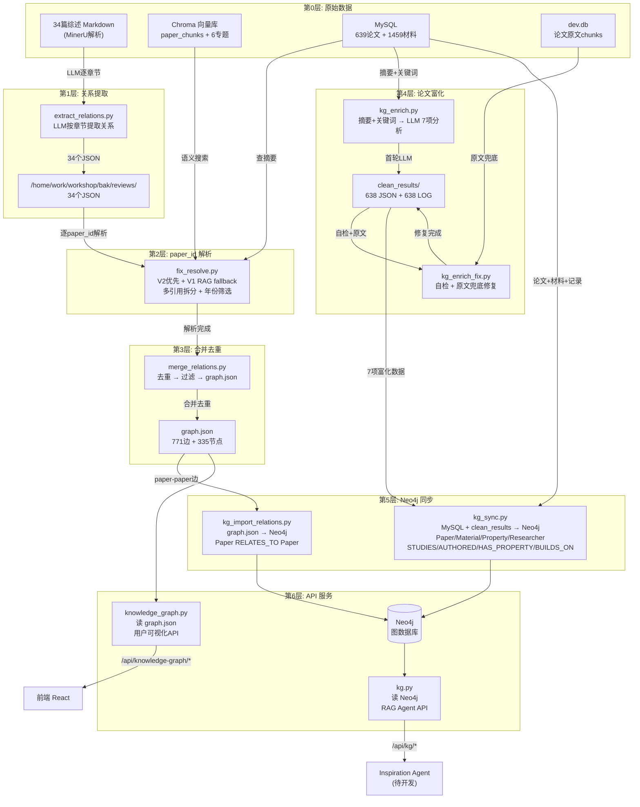
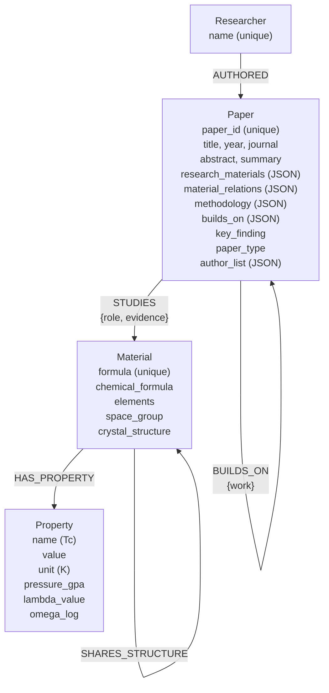

# 超导知识图谱构建总结

> 从 34 篇综述论文出发，构建包含 639 篇论文、1459 种材料、1481 位研究者的知识图谱，支持前端可视化和 RAG Agent 图遍历推理。

---

## 目录

1. [项目概述](#1-项目概述)
2. [整体架构](#2-整体架构)
3. [流水线详解](#3-流水线详解)
4. [数据模型](#4-数据模型)
5. [错误与解决方案](#5-错误与解决方案)
6. [API 设计](#6-api-设计)
7. [代码实现要点](#7-代码实现要点)
8. [未来规划](#8-未来规划)

---

## 1. 项目概述

### 1.1 目标

从超导领域中英文综述论文出发，自动提取论文间关系，结合 MySQL 中的实验数据（`superconductor_dataset`），构建一个完整的知识图谱，最终支撑两个场景：

- **前端可视化**：用户浏览论文关系图
- **Inspiration Agent**：RAG Agent 基于图遍历进行科学推理（待开发）

### 1.2 数据源

| 数据源 | 内容 | 规模 |
|--------|------|------|
| MinerU 解析的综述论文 Markdown | 34 篇中英文综述正文 | ~34 个 .md 文件 |
| Chroma 向量数据库 | 论文全文分块（paper_chunks + 6 个专题集合） | ~6000+ chunks |
| MySQL superconductor_dataset | 论文元数据 + 超导材料实验记录 | 639 篇论文, 1459 种材料 |
| dev.db (SQLite) | 论文原文全文分块（paper_chunks 表） | 用于兜底补充 |

### 1.3 最终产物

```
Neo4j 图数据库:
  Paper(639)  Material(1459)  Property(316)  Researcher(1481)
  STUDIES(1416)  RELATES_TO(771)  BUILDS_ON(541)  AUTHORED(3709)  HAS_PROPERTY(316)

graph.json: 771 条边, 335 个节点（综述论文关系子图）

data/clean_results/: 638 个 JSON + 638 个 LOG（LLM 富化结果）
```

---

## 2. 整体架构

### 2.1 四层架构

```
┌────────────────────────────────────────────────────────────────────┐
│                        前端 (React + vis.js)                        │
│              /knowledge 页面 ← /api/knowledge-graph/*              │
├────────────────────────────────────────────────────────────────────┤
│                    API 层 (FastAPI)                                 │
│   ┌──────────────────────┐  ┌──────────────────────┐               │
│   │ knowledge_graph.py   │  │      kg.py           │               │
│   │ 读 graph.json        │  │ 读 Neo4j             │               │
│   │ 用户可视化            │  │ RAG Agent 图遍历      │               │
│   └──────────────────────┘  └──────────────────────┘               │
├────────────────────────────────────────────────────────────────────┤
│                    存储层                                           │
│   ┌──────────┐  ┌──────────┐  ┌──────────────────┐                │
│   │ MySQL    │  │ Neo4j    │  │ graph.json       │                │
│   │ 论文/材料 │  │ 图数据库  │  │ 综述paper-paper  │                │
│   └──────────┘  └──────────┘  └──────────────────┘                │
├────────────────────────────────────────────────────────────────────┤
│                    构建流水线 (8个Python脚本)                        │
│   extract_relations → fix_resolve → merge_relations                │
│   → kg_enrich → kg_enrich_fix → kg_sync → kg_import_relations     │
│   → API 暴露                                                       │
└────────────────────────────────────────────────────────────────────┘
```

### 2.2 数据流图



---

## 3. 流水线详解

### 3.1 Step 1: extract_relations.py — 关系提取

**做了什么：** 34 篇综述论文 → 按 `##` 标题分段 → 每段调 LLM 提取论文间关系 → 生成 JSON。

**核心逻辑：**

```
对于 .md 正文的每个章节（排除 References、Acknowledgments）:
  LLM Prompt: 你是超导文献分析专家。提取该章节中描述的论文间关系。
  输出: source/target 的 author_info + search_queries + relation_type + evidence + confidence

输出: /home/work/workshop/bak/reviews/{综述名}.json
汇总: /home/work/workshop/bak/knowledge_graph.json
```

**关键设计决策：**
- `search_queries` 搜索的是论文自身内容，不是"引用者视角的描述"——这是后来 paper_id 解析成功的关键
- 8 种关系类型：`first_discovery`, `experimental_validation`, `theoretical_basis`, `correction_or_dispute`, `development_extension`, `material_system_extension`, `same_research_direction`, `supporting_evidence`
- 关系权重按类型不同（0.4 ~ 0.9）

**代码状态：** 当前仓库未找到对应的 `extract_relations.py` 实现，本文内容待核验。

---

### 3.2 Step 2: fix_resolve.py — paper_id 解析

**做了什么：** 对每篇综述提取的每条关系中的 source/target，通过多路搜索 + LLM 验证，确定对应 MySQL 中的 paper_id。

**解析策略（三级 fallback）：**

```
V2 优先 (resolve_v2): summary 向量搜索 → 直接匹配 MySQL 论文
  ↓ 失败
V1 RAG 回退:
  1. Chroma 向量搜索（6个 collection）→ top-5 candidates
  2. 年份筛选（±2年）
  3. LLM 标题筛选 → 排除材料体系不匹配的
  4. LLM 摘要匹配 → 选出最佳匹配
  5. 摘要失败 → 用 RAG 返回的原文 chunk 再试
  ↓ 失败
fallback: rag_first（取 RAG 排序第一）
```

**关键修复：**
- **多引用拆分**：`文献[14,22]` → 拆成独立的两条关系
- **Chroma 直接调用**：不通过 HTTP API，直接 import collection，避免 timeout
- **综述过滤**：从 Chroma `review_chunks` 获取综述 paper_id 集合，搜索时自动排除

**结果：** 34 篇综述 100% paper_id 解析完成。

**代码状态：** 当前仓库未找到对应的 `fix_resolve.py` 实现，本文内容待核验。

---

### 3.3 Step 3: merge_relations.py — 合并去重

**做了什么：** 34 个 review JSON → 合并所有关系 → 去重（source+target+type 三元组）→ 过滤低质量边 → 输出 `graph.json`。

**过滤规则：**
- 排除自环（source == target）
- `importance > 0.25`（importance = freq×0.3 + weight×0.4 + quality×0.3）
- 节点 label 优先用 paper_id 查 MySQL 标题，没有则用 author_info

**结果：** 1148 条原始关系 → 771 条边（去重后）+ 335 个节点

**代码状态：** 当前仓库未找到对应的 `merge_relations.py` 实现，本文内容待核验。

---

### 3.4 Step 4: kg_enrich.py — 论文富化（首轮）

**做了什么：** 对 MySQL 中 638 篇有摘要的论文 → 调 DeepSeek v4-flash → 生成 7 项结构化数据。

**LLM 输入：** 仅 `标题 + 摘要 + 关键词`（用户要求：不喂 superconductor 实验记录表数据）

**LLM 7 项任务：**

| # | 字段 | 含义 | 示例 |
|---|------|------|------|
| 1 | `research_materials` | 论文自身研究的材料 | `["Li2MgH16"]` |
| 2 | `referenced_materials` | 引言中提及/对比的材料 | `["LaH10"]` |
| 3 | `paper_type` | 论文类型（可多选） | `["calculate", "method"]` |
| 4 | `material_relations` | 论文→材料关系 | `[{"material":"Li2MgH16","relation":"investigates","evidence":"..."}]` |
| 5 | `key_properties` | 关键物性值（含条件） | `{"Li2MgH16":[{"name":"diffusivity","value":6e-06,"unit":"cm²/s","condition":{...}}]}` |
| 6 | `methodology` | 研究方法列表 | `["DFT", "path-integral"]` |
| 7 | `builds_on` | 前驱工作 | `[{"work":"Allen-Dynes Tc equation","hint":"Allen, Dynes, 1975"}]` |
| + | `key_finding` | 核心发现一句话 | `"质子扩散系数在高压下显著降低"` |
| + | `rationale` | 判断依据 | |

**输出：** `data/clean_results/{paper_id}.json` + `{paper_id}.log`（完整对话记录）

**代码状态：** 当前仓库未找到对应的 `kg_enrich.py` 实现，本文内容待核验。

---

### 3.5 Step 5: kg_enrich_fix.py — 自检修复（第二轮）

**做了什么：** 对首轮结果中不完整或有占位符的论文 → LLM 自检 → 从 dev.db 读取原文全文 → 重新分析。

**修复逻辑：**

```
对每个 JSON 文件:
  if is_complete(data) && 无占位符材料名:
    skip

  # 自检轮
  LLM: "请检查你上面的回答是否完整准确。材料名是否是占位符？"
  → if complete: skip

  # 原文兜底
  从 dev.db paper_chunks 读取 ~4000 字原文
  LLM: "这是论文原文，请修正之前的分析。"
  → 覆盖原 JSON
```

**关键修复：** `is_complete()` 允许综述/方法论论文的 `research_materials` 为空

**代码状态：** 当前仓库未找到对应的 `kg_enrich_fix.py` 实现，本文内容待核验。

---

### 3.6 Step 6: kg_sync.py — MySQL → Neo4j 完整同步

**做了什么：** 从 MySQL 读全量数据 + clean_results JSON → 写入 Neo4j。

**同步内容：**

| 方法 | 节点/关系 | 数据来源 |
|------|----------|---------|
| `sync_papers()` | Paper(639) | MySQL papers 表 + clean_results JSON (7项) |
| `sync_materials()` | Material(1459) | MySQL superconductors 表 |
| `sync_properties()` | Property(316) + HAS_PROPERTY(316) | MySQL superconductor_records 表 (Tc/λ/ω_log) |
| `sync_researchers()` | Researcher(1481) + AUTHORED(3709) | Paper.author_list JSON 解析 |
| `sync_studies()` | STUDIES(1416) | clean_results material_relations |
| `sync_builds_on()` | BUILDS_ON(541) | clean_results builds_on（当前均为 paper_id:-1 占位符） |
| `sync_shares_structure()` | SHARES_STRUCTURE(0) | Material.space_group 匹配（当前为空） |

**多线程设计：** `ThreadPoolExecutor` 分批并行写入，默认 4 worker。

**核心 Cypher 模式：**
```cypher
MERGE (p:Paper {paper_id: $id}) SET p += $props
MERGE (m:Material {formula: $f})
MERGE (p)-[r:STUDIES {role: $role}]->(m)
```

**代码状态：** 当前仓库未找到对应的 `kg_sync.py` 实现，本文内容待核验。

---

### 3.7 Step 7: kg_import_relations.py — 综述关系导入

**做了什么：** 读 `graph.json` → 将 paper-paper 关系写入 Neo4j（`RELATES_TO` 关系类型）。

**关键修复：**
- 节点 ID 格式转换：`"paper_123"` (graph.json) → `123` (Neo4j paper_id)
- 对于 kg_sync 未建的节点（仅出现在综述关系中），补充创建基本 Paper 节点
- 跳过 hash 命名节点（`node_xxx`），因为没有 paper_id 无法匹配

**代码状态：** 当前仓库未找到对应的 `kg_import_relations.py` 实现，本文内容待核验。

---

### 3.8 Step 8-9: API 暴露

**用户 API (`/api/knowledge-graph/*`)：**

| 端点 | 功能 | 数据源 |
|------|------|--------|
| `GET /overview?limit=10` | 首页图谱，按 importance 降序 | graph.json |
| `GET /papers/{id}/neighbors?limit=10` | 展开节点一层关联 | graph.json |
| `GET /papers/{id}` | 论文节点详情（关系摘要） | graph.json |
| `GET /stats` | 图谱统计（节点/边/类型分布） | graph.json |

**RAG API (`/api/kg/*`)：**

| 端点 | 功能 | 数据源 |
|------|------|--------|
| `GET /traverse?paper_id=&depth=2` | 多跳图遍历 | Neo4j |
| `GET /path?from_paper=&to_paper=` | 两篇论文最短路径 | Neo4j |
| `GET /around?paper_id=` | 论文上下文（材料+关联+前驱+作者） | Neo4j |
| `GET /material/{formula}` | 材料上下文（研究论文+物性） | Neo4j |
| `GET /search?q=` | 模糊搜索（标题/化学式） | Neo4j |

**代码状态：** 当前仓库仅找到 `backend/api/kg.py`；未找到 `backend/api/knowledge_graph.py`。前者可核验，后者待核验。

---

## 4. 数据模型

### 4.1 Neo4j Schema



### 4.2 clean_results JSON Schema

```json
{
  "research_materials": ["Li2MgH16"],
  "referenced_materials": ["LaH10"],
  "paper_type": ["calculate", "method"],
  "material_relations": [
    {
      "material": "Li2MgH16",
      "relation": "investigates",
      "evidence": "原文证据..."
    }
  ],
  "key_properties": {
    "Li2MgH16": [
      {
        "name": "diffusivity",
        "name_note": "质子扩散系数",
        "value": 6e-06,
        "unit": "cm²/s",
        "condition": {
          "pressure": {"value": 250, "unit": "GPa"},
          "temperature": {"value": 300, "unit": "K"}
        },
        "condition_note": "",
        "is_primary": true
      }
    ]
  },
  "methodology": ["DFT", "path-integral"],
  "builds_on": [
    {
      "work": "Allen-Dynes Tc equation",
      "hint": "Allen, Dynes, 1975"
    }
  ],
  "key_finding": "质子扩散系数在高压下显著降低",
  "rationale": "判断依据...",
  "paper_id": 1,
  "paper_title": "Proton diffusion in ...",
  "paper_doi": ""
}
```

### 4.3 graph.json Schema

```json
{
  "nodes": [
    {
      "id": "paper_123",
      "label": "论文标题（从MySQL查）",
      "paper_id": 123,
      "match_method": "summary_verified"
    }
  ],
  "edges": [
    {
      "source": "paper_100",
      "target": "paper_200",
      "type": "experimental_validation",
      "label": "实验验证",
      "importance": 0.85,
      "evidence": "原文证据..."
    }
  ]
}
```

### 4.4 关系类型与含义

| 关系 | 含义 | 数据来源 | 数量 |
|------|------|---------|------|
| STUDIES | 论文研究某种材料（discovers/investigates/predicts） | clean_results | 1416 |
| RELATES_TO | 论文间学术关系（8种子类型） | graph.json | 771 |
| BUILDS_ON | 论文依赖前人工作 | clean_results | 541 |
| AUTHORED | 研究者撰写论文 | Paper.author_list | 3709 |
| HAS_PROPERTY | 材料具有物性值（Tc/λ/ω_log） | MySQL records | 316 |
| SHARES_STRUCTURE | 材料共享晶体结构 | Material.space_group | 0 |

**RELATES_TO 子类型：**

| 类型 | 中文 | 权重 |
|------|------|------|
| `first_discovery` | 首次发现 | 0.9 |
| `experimental_validation` | 实验验证 | 0.9 |
| `theoretical_basis` | 理论基础 | 0.8 |
| `correction_or_dispute` | 修正或争议 | 0.7 |
| `development_extension` | 发展延续 | 0.6 |
| `material_system_extension` | 材料体系扩展 | 0.6 |
| `same_research_direction` | 同方向里程碑 | 0.5 |
| `supporting_evidence` | 支撑证据 | 0.4 |

---

## 5. 错误与解决方案

### 5.1 LLM 调用相关

| # | 问题 | 根因 | 解决方案 |
|---|------|------|---------|
| 1 | **JSON 解析失败** | DeepSeek v4-flash 将 JSON 放在 `reasoning_content` 而非 `content` 字段 | 优先从 `reasoning_content` 提取 JSON，用平衡括号匹配替代 `json.loads` |
| 2 | **多轮对话 assistant 消息重复** | 逐轮 `deepseek_chat()` 每轮都 append assistant 回复，导致重复 | 改为一次性发送全部 messages（`deepseek_chat()` 接收完整 messages 列表） |
| 3 | **material_relations 类型不一致** | LLM 有时返回字符串数组 `["LaH10"]` 而非 `[{"material":"LaH10",...}]` | 写入前 `isinstance(rel, str)` 检查并转换 |
| 4 | **64 篇论文 JSON 为空** | 首轮 LLM 返回不完整 | 重新运行 kg_enrich.py，再用 kg_enrich_fix.py 原文兜底 |

### 5.2 数据库/NEO4J 相关

| # | 问题 | 根因 | 解决方案 |
|---|------|------|---------|
| 5 | **Neo4j driver key 前缀** | `session.run()` 返回的 Record 中 key 是 `"p.property"` 而非 `"property"` | 所有 sync 方法改为 `r.get("p.property") or r.get("property")` |
| 6 | **Null Tc 导致 MERGE 失败** | MERGE 语句中 MATCH 条件包含值为 null 的属性 | 添加 `if not tc: continue` 过滤 |
| 7 | **kg_import ID 格式不匹配** | graph.json 用 `"paper_123"` (string)，kg_sync 用 `123` (int) | 导入前 `int(e["source"].replace("paper_", ""))` |
| 8 | **SHARES_STRUCTURE 返回 0** | MySQL superconductors 表 `space_group` 字段为空 | 待补充晶体结构数据 |

### 5.3 网络/性能相关

| # | 问题 | 根因 | 解决方案 |
|---|------|------|---------|
| 9 | **HTTP 请求 70s 超时** | Python requests 默认 keep-alive 连接在服务端闲置断开 | 添加 `headers={"Connection": "close"}` |
| 10 | **dev.db 数据未迁移到 MySQL** | 迁移脚本使用 DOI 匹配（dev.db 无 DOI） | 改用 `paper_id` 匹配 |

### 5.4 业务逻辑相关

| # | 问题 | 根因 | 解决方案 |
|---|------|------|---------|
| 11 | **综述/方法论论文被误判为不完整** | `is_complete()` 要求必须有 `research_materials` | 放宽规则：`paper_type` 含 "review"/"method" 时允许为空 |
| 12 | **多引用未拆分** | `文献[14,22]` 作为一个整体匹配，无法找到对应论文 | `split_multi_refs()` 正则拆分 + 笛卡尔积展开 |
| 13 | **材料体系不匹配被误匹配** | LLM 只看研究主题相似度，忽略了材料体系差异 | Prompt 强调"材料体系必须匹配"，增加标题筛选阶段 |

---

## 6. API 设计

### 6.1 设计原则

- **关注点分离**：用户 API（读静态 graph.json，轻量快速）vs RAG API（读 Neo4j，图遍历计算）
- **双源异构**：graph.json 是综述论文间关系（精选 771 边），Neo4j 是全部论文的完整图（6753 条关系）
- **渐进式加载**：前端 overview 默认返回 top-10 边，点击节点触发懒加载 neighbors

### 6.2 性能策略

| 策略 | 应用 |
|------|------|
| 静态 JSON 读取 | `/api/knowledge-graph/*` 直接 `json.load`，无数据库开销 |
| 图遍历限深 | `/api/kg/traverse?depth=2`（最大4） |
| 结果截断 | 所有端点默认 limit=10-20 |
| Neo4j 连接复用 | 模块级 `_driver` 单例 |

---

## 7. 代码实现要点

### 7.1 Chroma 直接调用（避免 HTTP 开销）

```python
# extract_relations.py — 不通过后端API，直接import collection
from backend.rag.ingest.embedder import embed_texts
from backend.rag.vectordb import _get_collection

query_vec = embed_texts([query])[0]
for col_name in SEARCH_COLLECTIONS:
    col = _get_collection(col_name)
    results = col.query(query_embeddings=[query_vec], n_results=5)
```

### 7.2 DeepSeek JSON 提取健壮性

```python
# kg_enrich.py — 处理 reasoning_content + 非标准JSON
content = msg.get("content", "") or msg.get("reasoning_content", "")
start = content.find("{")
if start >= 0:
    depth = 0
    for i in range(start, len(content)):
        if content[i] == "{": depth += 1
        elif content[i] == "}":
            depth -= 1
            if depth == 0:
                return content[start:i+1]
```

### 7.3 Neo4j 多线程同步

```python
# kg_sync.py — ThreadPoolExecutor 分批并发写 Neo4j
def _batches(items, n):
    size = max(1, len(items) // n)
    return [items[i:i + size] for i in range(0, len(items), size)]

batches = _batches(rows, self.workers)
with ThreadPoolExecutor(self.workers) as ex:
    list(ex.map(_batch_sync, batches))
```

### 7.4 日志同步输出

```python
# deepseek_chat() 写完整对话日志，方便调试LLM输出质量
if log_path:
    all_msgs = messages + [{"role": "assistant", "content": content}]
    log_lines = [f"[{m['role']}]\n{m['content']}\n" for m in all_msgs]
    log_path.write_text("\n---\n".join(log_lines), encoding="utf-8")
```

### 7.5 年份筛选加速匹配

```python
# fix_resolve.py — 年份±2缩小候选范围
target_year = _extract_year(enriched)
if target_year:
    meta = fetch_meta(list(candidates.keys()))
    year_filtered = {
        pid: m["title"]
        for pid, m in meta.items()
        if m.get("year") and abs(m["year"] - target_year) <= 2
    }
```

---

## 8. 未来规划

### 8.1 短期（数据质量）

| 项目 | 描述 | 优先级 |
|------|------|--------|
| clean_results 标准化 | paper_type 存在非标准值（"理论计算与数值模拟"、"博士论文"） | 🟡 中 |
| SHARES_STRUCTURE | 补充 Material.space_group 数据 | 🟡 中 |
| 前端 /knowledge 页面 | 接入 Neo4j API 实现深度图探索 | 🟡 中 |

### 8.2 中期（功能扩展）

| 项目 | 描述 |
|------|------|
| **Inspiration Agent** | 基于 `/api/kg/*` 的 5 种思考模式（类比推理、跨学科联想、反事实假设、外推预测、缺失环节发现），图遍历推理 → LLM 生成科研 idea |
| 时序演化分析 | 按年份切片展示研究方向的演化路径 |
| 材料相似度 | 基于图结构的材料 embedding（Node2Vec / GraphSAGE） |

### 8.3 长期（平台化）

| 项目 | 描述 |
|------|------|
| 自动化抽取 | 新论文入库时自动触发 extract → enrich → sync 流水线 |
| 多模态接入 | 图表、晶体结构图的实体识别和关系抽取 |
| 协作编辑 | 研究者可标注/修正 KG 中的关系和属性 |

---

## 附录 A: 文件清单

```
SC-Wiki/
├── backend/
│   ├── kg_pipeline/
│   │   ├── extract_relations.py    # Step 1: 综述关系提取
│   │   ├── fix_resolve.py          # Step 2: paper_id 解析 (含V2)
│   │   ├── merge_relations.py      # Step 3: 合并去重 → graph.json
│   │   ├── kg_enrich.py            # Step 4-5: 论文富化 + --fix 自检
│   │   ├── kg_sync.py              # Step 6: MySQL → Neo4j
│   │   └── kg_import_relations.py   # Step 7: graph.json → Neo4j
│   ├── scripts/
│   │   ├── import_data.py          # 数据导入
│   │   ├── export_data.py          # 数据导出
│   │   ├── migrate_dev_to_mysql.py # dev.db → MySQL
│   │   ├── build_summary_index.py  # 构建摘要索引
│   │   ├── init_db.py              # 初始化数据库
│   │   └── create_superadmin.py    # 创建管理员
│   └── services/
│       ├── alexandria_db.py        # Alexandria DB
│       ├── alexandria_import.py    # Alexandria 导入
│       ├── formula_similarity.py   # 化学式相似度
│       └── chart_rules.py          # 图表规则
│   └── api/
│       ├── knowledge_graph.py      # 用户 API (读 graph.json)
│       └── kg.py                   # RAG API (读 Neo4j)
├── data/
│   └── clean_results/              # 638 JSON + 638 LOG
├── docs/
│   └── 知识图谱构建总结.md          # 本文档
└── frontend/
    └── src/
        └── pages/
            └── KnowledgeGraphPage.tsx  # 知识图谱前端页面
```

## 附录 B: 运行命令

```bash
# 完整流水线
python backend/ingest/kg/extract_relations.py       # → reviews/*.json
python backend/ingest/kg/fix_resolve.py              # → 补全 paper_id
python backend/ingest/kg/merge_relations.py          # → graph.json
python backend/ingest/kg/kg_enrich.py                # → clean_results/*.json
python backend/ingest/kg/kg_enrich.py --fix          # → 自检 + 原文修复不完整项
python backend/ingest/kg/kg_sync.py --clear          # → Neo4j (全量同步)
python backend/ingest/kg/kg_import_relations.py      # → Neo4j (综述关系)

# 启动后端
python -m uvicorn backend.main:app --reload

# 验证 API
curl localhost:8000/api/knowledge-graph/overview?limit=10
curl localhost:8000/api/kg/around?paper_id=1
curl localhost:8000/api/kg/traverse?paper_id=1\&depth=2
curl "localhost:8000/api/kg/search?q=LaH10"
```
